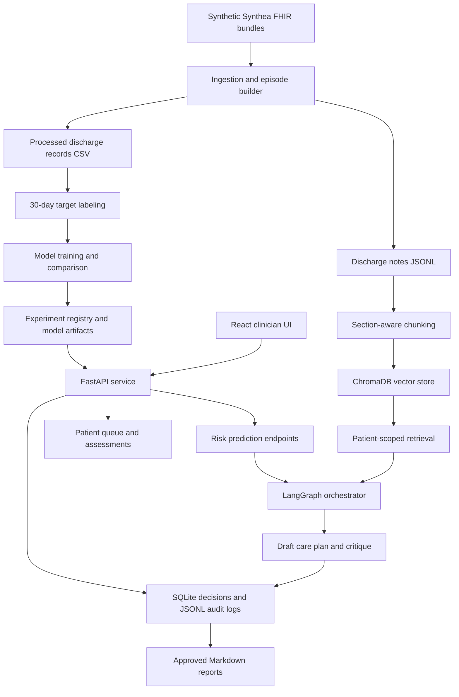

# Architecture Document

# Care Transition Copilot

## 1. Overview

Care Transition Copilot is a layered local MVP for discharge follow-up support.
It combines a survival-model risk service, patient-scoped chart retrieval,
LLM-backed care-plan drafting and critique, clinician review workflows, and a
React interface.

The architecture follows the project proposal's separation of concerns:

- The ML layer performs stable prediction and model evaluation.
- The retrieval layer finds patient-specific evidence.
- The agentic layer coordinates risk assessment, retrieval, reasoning, and
  critique.
- The review layer keeps clinicians in control of final decisions.

## 2. High Level Architecture



## 3. Repository Structure

| Path | Responsibility |
| --- | --- |
| `src/ingestion` | FHIR parsing, temporal filters, comorbidity and medication feature helpers, episode clustering. |
| `src/features` | 30-day readmission target construction. |
| `src/model` | Baseline training, model comparison, experiment registry, fairness audit. |
| `src/api` | FastAPI app, schemas, drift monitoring, production persistence helpers. |
| `src/embeddings` | Discharge-note chunking and ChromaDB build/validation. |
| `src/retrieval` | Patient-scoped vector retrieval. |
| `src/agents` | Risk tool, retrieval agent, reasoning agent, critique agent, chat tools, LangGraph orchestrator. |
| `web` | React/Vite clinician UI. |
| `scripts` | Data export, diagnostics, retrieval checks, model and data analysis helpers. |
| `data` | Synthetic samples and processed local datasets. |
| `results` | Experiment results, fairness output, audit logs, care plans, decisions. |
| `reports` | Generated mock care-transition reports. |
| `Docs` | Proposal, data documentation, diagrams, PRD, SRS, and architecture docs. |

## 4. Data Architecture

### 4.1 Source Data

The MVP uses synthetic Synthea FHIR bundles. The proposal also describes an
event-driven target state where HL7v2 ADT discharge messages trigger FHIR data
pulls. The current repo implements the FHIR side locally and uses synthetic
bundle files instead of a live EHR feed.

### 4.2 Canonical Records

FHIR data is flattened into `DischargeRecord`-style rows containing:

- Patient and encounter identifiers.
- Admit and discharge timestamps.
- Length of stay.
- Admission reason and service context.
- Medication counts and high-risk medication flags.
- Prior admissions.
- Protected attributes retained for fairness evaluation.
- Discharge note text exported separately for retrieval.

Structured model features and note text intentionally follow separate paths.
The risk model does not consume free-text notes, and the retrieval system does
not alter structured feature generation.

### 4.3 Episode Construction

Synthea can emit multiple encounter resources for one logical hospital stay.
`src/ingestion/episodes.py` clusters inpatient encounters into hospitalization
episodes before target labeling or feature export.

### 4.4 Target Labeling

`src/features/target.py` creates 30-day outcome labels:

- POSITIVE: unplanned readmission within the horizon.
- NEGATIVE: no unplanned readmission in the horizon.
- PLANNED: excluded planned readmission pattern.
- DEATH: death within the horizon.
- EXCLUDED: record excluded from model training.

This target design prevents planned oncology-style repeat visits and deaths
from being mislabeled as ordinary negative or positive examples.

## 5. Modeling Architecture

### 5.1 Baseline Model

The configured baseline is a Cox proportional hazards model trained on a small
set of interpretable structured features:

- `age_at_discharge`
- `length_of_stay_days`
- `medication_count`
- `prior_admissions_90d`
- `med_flag_diuretic`
- `med_flag_anticoagulant`

The Cox model returns a relative risk score, not an absolute probability.

### 5.2 Model Comparison

`src/model/compare_models.py` compares:

- Regularized Cox models.
- Random Survival Forest.
- Gradient Boosting Survival Analysis.

The comparison uses patient-grouped cross-validation so episodes from the same
patient do not leak across train and test folds.

### 5.3 Experiment Registry

`src/model/experiment_registry.py` logs model runs to
`results/experiments.csv` and stores regenerable model artifacts under
`models/{run_id}.joblib`.

The API loads the production run configured in `config.yaml`.

### 5.4 Fairness Audit

`src/model/fairness_audit.py` evaluates subgroup performance for sex and race.
At the current event count, the audit is inconclusive. The API and docs must
preserve this caveat and must not claim that the model passed a fairness audit.

## 6. Retrieval Architecture

### 6.1 Chunking

`src/embeddings/chunking.py` splits discharge notes by clinical section headers
instead of embedding whole notes. This prevents smaller but important sections,
such as comorbidities or assessment and plan, from being diluted by unrelated
note content.

### 6.2 Vector Store

`src/embeddings/build_vector_store.py` creates a persistent ChromaDB collection
named `discharge_notes` under `data/processed/chroma_db`.

Each stored chunk includes metadata such as patient ID, encounter ID, source
section, and note context.

### 6.3 Patient Scoped Querying

`src/retrieval/query_store.py` filters retrieval to one patient before semantic
ranking. It also:

- Applies a relevance-distance threshold.
- Over-fetches candidates.
- Removes highly similar chunks.
- Returns explicit no-match categories when relevant context is absent.

## 7. Agent Architecture

### 7.1 Risk Tool

`src/agents/risk_tool.py` looks up the patient's latest model features, calls
the live FastAPI `/predict` endpoint, and returns:

- Patient name.
- Risk score.
- Risk percentile.
- Risk category.
- Admission reason.

The tool fails with actionable setup guidance if the API is unavailable.

### 7.2 Retrieval Agent

`src/agents/retrieval_agent.py` performs category-based patient chart search.
In orchestrated mode it can generate dynamic categories from the patient's
admission reason and risk category. If generation fails, it falls back to fixed
validated categories.

### 7.3 Reasoning Agent

`src/agents/reasoning_agent.py` drafts a care plan from retrieved context and
risk framing. It is prompted to avoid unsupported clinical claims and to keep
uncertain or missing documentation visible as reviewer-facing notes.

### 7.4 Critique Agent

`src/agents/critique_agent.py` reviews the draft for hallucination, clinical
overreach, and missed caveats. It receives the same validated risk context as
the reasoning agent so it does not incorrectly flag the risk percentile as an
unsupported chart claim.

### 7.5 LangGraph Orchestrator

`src/agents/orchestrator.py` implements the workflow:

```mermaid
flowchart LR
    start["Start"] --> risk["Risk assessment"]
    risk --> decision{"Risk category"}
    decision -->|"low"| low["Templated low-risk summary"]
    decision -->|"medium/high"| retrieve["Dynamic retrieval"]
    retrieve --> reason["Draft care plan"]
    reason --> critique["Critique plan"]
    low --> end["End"]
    critique --> end
```

Low risk patients skip retrieval, reasoning, and critique. Medium and high risk
patients run the full agent workflow.

### 7.6 Chat Agent

`src/agents/chat_agent.py` supports free-form clinician questions. It exposes
auditable tools for risk assessment and chart search, and returns tool calls
alongside the answer.

## 8. API Architecture

### 8.1 Startup

On startup, `src/api/main.py`:

1. Loads configuration and runtime dependency status.
2. Loads the configured production model artifact.
3. Reads the processed modeling dataset.
4. Computes reference risk scores for percentiles.
5. Builds the patient queue data frame.
6. Initializes assessment cache state.
7. Initializes the decision database.
8. Builds the `/predict` request model dynamically from loaded feature names.

### 8.2 Dynamic Predict Schema

The `/predict` request schema is generated from the model artifact's saved
feature list. This prevents the API schema from drifting away from the currently
served model.

### 8.3 Authentication and Request Tracing

All non-health endpoints require an `X-API-Key` header matching `API_KEY`.
The middleware attaches an `X-Request-ID` response header and accepts incoming
request IDs for traceability.

### 8.4 Persistence

Current local persistence uses:

- `results/audit_log.jsonl` for audit events.
- `results/care_plans.jsonl` for generated care plans.
- `results/decisions.sqlite3` for clinician decisions.
- `results/prediction_log.csv` for served predictions.
- `reports/*.md` for approved mock transition reports.

These are local MVP stores. Production architecture should replace them with
managed database tables, durable object storage, and formal audit retention.

## 9. Web Architecture

The frontend is a React/Vite application under `web`.

### 9.1 Routes

| Route | Component | Purpose |
| --- | --- | --- |
| `/` | `Dashboard` | Risk queue, assessment details, evidence, decision actions, report status. |
| `/chat` | `ChatInterface` | Free-form questions with tool-call audit trail. |
| `/patients` | `Patients` | Recent discharged patient list. |
| `/care-plans` | `CarePlans` | Select patient and generate or view draft plan. |

### 9.2 API Client

The frontend API client sends:

- API base URL.
- `X-API-Key` from `VITE_API_KEY`.
- Request timeout settings.
- Request IDs for traceability.

### 9.3 Display Rules

The UI strips synthetic numeric suffixes from patient names for display only.
It also formats patient evidence into readable grouped blocks and suppresses raw
no-match retrieval lines in the main evidence panel.

## 10. Security Architecture

### Current MVP

- API-key protection for non-health endpoints.
- Secret values expected in `.env`, with `.env.example` as template.
- Synthetic data only.
- No production user accounts or PHI.

### Target Production

- OAuth2 or SSO login.
- Role-based access control.
- Per-user clinician attribution.
- Managed secrets.
- Formal audit log retention.
- EHR-scoped access controls.

## 11. Observability Architecture

Current observability includes:

- `/health` dependency report.
- Safe error responses with request IDs.
- Prediction logging for drift checks.
- JSONL audit events.
- Saved care-plan records.
- Model registry results.
- Fairness audit reports.

Target production observability includes:

- Prometheus metrics.
- Grafana dashboards.
- Centralized structured logs.
- Alerting for API failures, LLM failures, retrieval failures, drift, and audit
  write failures.

## 12. Deployment Architecture

### Local MVP

The local MVP runs as:

1. Python data and model pipeline.
2. FastAPI backend on port 8080.
3. React/Vite frontend on port 5173.
4. Local ChromaDB persisted under `data/processed/chroma_db`.
5. Local file and SQLite persistence under `results` and `reports`.

### Target Production

The proposal's target deployment includes:

- FHIR or HL7v2 intake adapter.
- Kafka or equivalent event bus.
- Managed Postgres for episodes, decisions, audit IDs, and features.
- Managed vector database or ChromaDB deployment for clinical text.
- Redis or managed cache for repeat lookups.
- Model serving API with CI/CD.
- Clinician web app behind enterprise authentication.
- FHIR write-back and patient notification services.

## 13. Failure Handling

| Failure | Current Behavior | Target Behavior |
| --- | --- | --- |
| Missing API key | API returns 401. | Same, with identity-aware auth. |
| Missing processed data | Startup or health reports dependency issue. | Pipeline alert and runbook. |
| Risk API unavailable to agent | Risk tool raises actionable setup error. | Retry, circuit breaker, alert. |
| LLM timeout | Runtime timeout surfaces API error. | Retry policy and fallback workflow. |
| Retrieval no match | No-match categories remain explicit. | Same, plus relevance monitoring. |
| Rejected plan | Report endpoint returns edit-required status. | Edit and resubmission workflow. |

## 14. Architecture Decisions

| Decision | Rationale |
| --- | --- |
| Use Cox baseline first. | Small event count favors interpretability and lower overfitting risk. |
| Keep text out of structured risk model. | Reduces leakage and keeps model inputs auditable. |
| Use patient-scoped retrieval. | Prevents evidence from other patients entering context. |
| Route low risk patients away from full LLM workflow. | Saves cost and avoids unnecessary generated text. |
| Require clinician approval. | Keeps AI output as draft support, not autonomous care direction. |
| Generate predict schema from model features. | Prevents model/API schema drift. |
| Use local JSONL and SQLite for MVP. | Simple demo persistence before managed services are needed. |

## 15. Known Limitations

- The model is trained on a small number of positive events.
- The fairness audit is inconclusive, not passed.
- The risk score is relative and not a calibrated probability.
- Comorbidity categorization is keyword-based and would need production-grade
  clinical mapping.
- Reasoning and critique use different model sizes on the same provider path,
  not truly independent model providers.
- Full care-plan editing is not yet implemented.
- FHIR write-back and notification delivery are planned, not implemented.
- Local persistence is not production durable storage.

## 16. Future Architecture Work

1. Replace local JSONL and SQLite persistence with managed database tables.
2. Add true authentication, RBAC, and clinician identity.
3. Implement edit and resubmission workflow for rejected plans.
4. Add FHIR write-back and notification stubs.
5. Add production CI/CD and deployment manifests.
6. Add Prometheus, Grafana, and alerting.
7. Scale data for determinate fairness evaluation.
8. Calibrate retrieval thresholds against labeled relevance examples.
9. Strengthen independence between reasoning and critique models.
10. Add formal integration tests for the full API and UI workflow.

