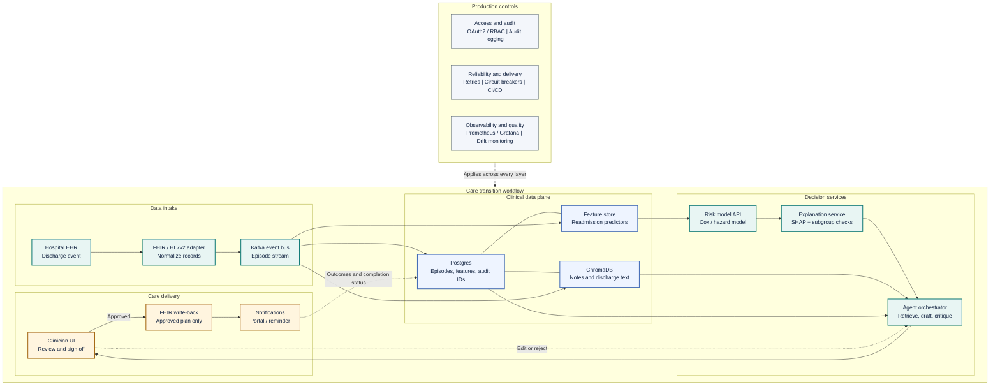

# Care Transition Copilot

An AI system that predicts 30-day hospital readmission risk, retrieves the
relevant patient context, and drafts a personalized follow-up plan, with a
clinician reviewing and approving every plan before it reaches a patient
record.

## Problem

Hospitals often know which discharged patients are at elevated readmission risk,
but the risk score, patient context, and follow-up plan usually live in separate
systems. This project connects those pieces into one workflow: predict who is at
risk, retrieve the clinical context, draft a follow-up plan, and route it through
clinician review before action. 

## What this is

Three layers, each doing the job it is suited for:

- **ML** - a survival/hazard model scores readmission risk and is audited for
  fairness across patient subgroups.
- **Agents** - a retrieval agent pulls chart context; a coordinated agent
  workflow drafts a follow-up plan and runs it through checklist-based critique.
- **Human review** - nothing reaches the patient or their record without
  explicit clinician sign-off in the web app.

The system is designed to move four outcomes together: fewer avoidable
readmissions, lower readmission costs, faster care coordination, and more
completed follow-ups. The value comes from connecting risk stratification,
context retrieval, plan drafting, and clinician approval into one operational
loop.

## How it works


1. A discharge event enters the system.
2. The risk model scores the patient's chance of readmission within 30 days.
3. High-risk patients trigger chart retrieval and follow-up plan drafting.
4. A second model critiques the draft against fixed safety and completeness
   checks.
5. A clinician approves, edits, or rejects the plan.
6. Approved plans are written back to the record and used for patient follow-up.
7. Outcomes feed back into the data layer for monitoring and improvement.

## Target architecture

The diagram below shows the intended end-to-end architecture. The current
codebase has implemented the local synthetic-data, ingestion, feature,
target-labeling, baseline/model-comparison, experiment registry, fairness-audit,
section-aware note chunking, vector-store indexing, and risk-model API pieces
first. Agent orchestration, persistence services, and the clinician UI are still
planned work.



- **Implemented data path** - synthetic FHIR bundles are parsed into canonical
  discharge episodes, structured CSV features, and JSONL discharge-note records.
- **Implemented prediction path** - a baseline Cox proportional hazards model
  trains on the labeled positive/negative episodes with a patient-grouped split.
  Model-comparison diagnostics evaluate Cox, Random Survival Forest, and
  Gradient Boosting survival configurations with patient-grouped
  cross-validation. The current configured production run is
  `20260915_113931_cdd23e`.
- **Implemented serving path** - FastAPI serves the configured saved model, builds
  the `/predict` request schema from that model's saved feature list, logs live
  predictions, and exposes a drift report against the training reference
  distribution.
- **Implemented retrieval foundation** - discharge notes are split into
  section-aware chunks, embedded into a local persistent ChromaDB collection, and
  validated with open-corpus and patient-scoped retrieval checks.
- **Planned agents** - LangGraph will coordinate retrieval, care-plan drafting,
  critique, explanation, and clinician handoff.
- **Planned review and action** - a clinician-facing app will keep AI output in
  draft state until approval, then write the plan back through FHIR and send
  follow-up notifications.
- **Planned platform services** - OAuth2/RBAC, full audit logging, CI/CD,
  production monitoring, retries, and circuit breakers support the workflow.

## Application scope

The MVP focuses on four user-facing capabilities:

- Risk scoring for recently discharged patients.
- Clinical context retrieval with source citations.
- Care-plan orchestration with draft, critique, and explanation steps.
- Clinician actions to approve, edit, reject, notify, or open the patient portal.

## Implemented progress

The current repository shows the first stage of the MVP working locally:

- Parsed inpatient-only Synthea FHIR bundles into a canonical
  `DischargeRecord` schema.
- Clustered raw inpatient encounters into hospitalization episodes so same-stay
  encounters are not counted as readmissions.
- Added time-aware condition and medication filters to avoid using data that was
  not known at discharge.
- Engineered structured predictors: length of stay, age at discharge,
  medication burden, high-risk medication flags, comorbidity categories, prior
  admissions, and protected attributes for later fairness evaluation.
- Exported free-text discharge notes separately to `discharge_notes.jsonl` so
  retrieval work can use notes without leaking text into tabular model inputs.
- Built a rigorous 30-day readmission target with positive, negative, death,
  planned, and excluded outcomes.
- Added a baseline Cox proportional hazards model with a patient-grouped
  train/test split and coefficient/hazard-ratio reporting.
- Added grouped cross-validation for model comparison across regularized Cox,
  Random Survival Forest, and Gradient Boosting Survival Analysis candidates.
  The comparison reports mean C-index, standard deviation, usable fold count,
  and per-fold scores so small-sample variance is visible.
- Added a comorbidity-count diagnostic that compares Cox performance with and
  without `comorbidity_count`, helping decide whether to keep the feature out
  for interpretability or restore it for stronger risk ranking.
- Added a lightweight experiment registry in `results/experiments.csv`, with
  every logged run tied to a saved `models/{run_id}.joblib` artifact. The saved
  model artifacts are regenerable and gitignored.
- Added `src.model.compare_experiments` to compare logged runs side by side and
  flag likely overfitting when the train/test C-index gap is greater than 0.15.
- Added a fairness audit for sex and race subgroup performance. At the current
  event count it is intentionally reported as inconclusive, not as a passed
  fairness validation.
- Added a FastAPI risk-model service with `/health`, `/model-info`, `/predict`,
  and `/drift-report` endpoints. The prediction request schema is generated from
  the loaded model's actual feature list, so changing `model.production_run_id`
  in `config.yaml` updates the served schema on restart.
- Added section-aware discharge-note chunking in `src.embeddings.chunking`.
  Notes are split on clinical headers such as chief complaint, history, and
  assessment/plan instead of embedding whole notes, so secondary conditions are
  not diluted by unrelated note sections.
- Added a local ChromaDB vector-store build in `src.embeddings.build_vector_store`
  and validation in `src.embeddings.validate_vector_store`. The vector database
  is stored at `data/processed/chroma_db/`, is gitignored, and can be rebuilt
  from `data/processed/discharge_notes.jsonl`.
- Added retrieval diagnostics for CHF mention coverage and patient-scoped
  retrieval behavior in `scripts/check_chf_notes.py`,
  `scripts/check_patient_chf_history.py`, and `scripts/test_scoped_retrieval.py`.

Committed processed data currently includes:

| Artifact | Current contents |
| -------- | -----------------|
| `data/processed/discharge_records.csv` | 3,110 inpatient episodes from 1,341 patients |
| `data/processed/discharge_notes.jsonl` | 3,110 discharge-note records keyed by encounter |
| `data/processed/discharge_records_with_target.csv` | 2,593 negative, 52 positive, 380 planned, 60 death, and 25 excluded outcomes |
| Modeling set | 2,645 positive/negative episodes from 1,328 patients |

Latest model-comparison summary:

| Model/configuration | Mean C-index | Std | Notes |
| --- | ---: | ---: | --- |
| Cox, `alpha=5.0` | 0.736 | 0.084 | Best cross-validated mean |
| Cox, `alpha=1.0` | 0.732 | 0.085 | Chosen baseline for interpretability and registry/API consistency |
| Best Random Survival Forest | 0.721 | 0.072 | Did not beat Cox enough to justify added complexity |
| Best Gradient Boosting Survival Analysis | 0.691 | 0.091 | Lower mean and higher variance |

The official baseline v1 registry run is `20260915_113931_cdd23e`: Cox
Proportional Hazards, `alpha=1.0`, six features, 1,967 train episodes, 678 test
episodes, 40 train events, 12 test events, and train/test C-index
`0.7757 / 0.6844`. The single split is noisier than the grouped CV summary, so
the README and `results/RESULTS.md` treat the CV comparison as the more reliable
model-selection evidence.

Latest retrieval/vector-store summary:

| Component | Current behavior |
| --- | --- |
| Chunking | Splits discharge notes by markdown-style clinical section headers and drops date-only preambles |
| Short sections | Merges tiny boilerplate sections into neighboring content before embedding |
| Vector store | Builds a persistent ChromaDB collection named `discharge_notes` under `data/processed/chroma_db/` |
| Embeddings | Uses ChromaDB's default local embedding function; first run may download the model cache |
| Validation | Runs broad clinical queries and patient-scoped retrieval checks with metadata inspection |

## Clinician UI


Design principles from the proposal:

- AI-generated care plans are always visibly drafts until a clinician acts.
- Every risk score and retrieved chart fact should be traceable to its source.
- Fairness alerts belong on the main dashboard, not buried in settings.

## Status

MVP in progress. The local data, modeling, retrieval foundation, and first
serving layer are now implemented: FHIR ingestion, hospitalization episode
construction, feature export, 30-day target labeling, baseline Cox survival
modeling, patient-grouped cross-validation for comparing Cox, Random Survival
Forest, and Gradient Boosting survival candidates, experiment logging/model
saving, fairness-audit infrastructure, section-aware note chunking, ChromaDB
vector-store indexing, and a FastAPI wrapper for the configured model run.

The current modeling work is still diagnostic rather than production-ready. The
dataset has only 52 positive readmission events, so the comparison workflow
surfaces mean C-index, fold-to-fold standard deviation, and per-fold scores
instead of treating any single split as definitive. The fairness audit is also
inconclusive at this dataset size because most protected subgroups do not have
enough positive events for a reliable comparison.

Next milestones are scaling the synthetic population for a determinate fairness
audit, adding a retrieval-agent interface with source citations, agent
orchestration, persistence/audit services, and a clinician-facing demo workflow.

## Getting started

### Prerequisites

- Python 3.12+
- `uv` or `pip`
- Java 11+ (for Synthea, the synthetic data generator)
- Docker + Docker Compose for the planned Postgres and Redis services
- Network access on the first vector-store build so ChromaDB can cache its
  default local embedding model

### Setup

```bash
# 1. Clone and enter the repo
git clone <repo-url>
cd care-transition-copilot

# 2. Copy env template and fill in real values
cp .env.example .env

# 3. Install Python dependencies
uv pip install -r requirements.txt
# or:
pip install -r requirements.txt

# 4. Generate synthetic patient data
./scripts/generate_synthetic_data.sh

# 5. Export structured records and discharge notes
python scripts/export_records.py

# 6. Build the 30-day readmission target
python -m src.features.target

# 7. Train and inspect the baseline survival model
python -m src.model.train_baseline

# 8. Compare survival model families with grouped cross-validation
python -m src.model.compare_models

# 9. Log a reproducible baseline run and saved model artifact
python -m src.model.run_experiment --alpha 1.0 --notes "baseline, 6 features"

# 10. Compare logged experiment-registry runs
python -m src.model.compare_experiments

# 11. Run the fairness audit
python -m src.model.fairness_audit

# 12. Build and validate the discharge-note vector store
python -m src.embeddings.build_vector_store
python -m src.embeddings.validate_vector_store
python scripts/test_scoped_retrieval.py

# 13. Serve the configured model run from config.yaml
uvicorn src.api.main:app --reload
```

### API smoke tests

After starting the API with `uvicorn src.api.main:app --reload`, open the
interactive docs at `http://127.0.0.1:8000/docs` or run these commands.

PowerShell:

```powershell
Invoke-RestMethod http://127.0.0.1:8000/health

Invoke-RestMethod http://127.0.0.1:8000/model-info

$body = @{
  age_at_discharge = 72
  length_of_stay_days = 5
  medication_count = 9
  prior_admissions_90d = 1
  med_flag_diuretic = $true
  med_flag_anticoagulant = $false
} | ConvertTo-Json

Invoke-RestMethod `
  -Uri http://127.0.0.1:8000/predict `
  -Method Post `
  -ContentType "application/json" `
  -Body $body

Invoke-RestMethod http://127.0.0.1:8000/drift-report
```

Bash/curl:

```bash
curl http://127.0.0.1:8000/health

curl http://127.0.0.1:8000/model-info

curl -X POST http://127.0.0.1:8000/predict \
  -H "Content-Type: application/json" \
  -d '{
    "age_at_discharge": 72,
    "length_of_stay_days": 5,
    "medication_count": 9,
    "prior_admissions_90d": 1,
    "med_flag_diuretic": true,
    "med_flag_anticoagulant": false
  }'

curl http://127.0.0.1:8000/drift-report
```

`/predict` returns a relative Cox risk score, percentile, and low/medium/high
risk category. `/drift-report` needs at least 30 logged predictions before it
can make a meaningful drift assessment.

### Useful analysis scripts

```bash
python scripts/EDA.py
python scripts/check_resources.py
python scripts/check_comorbidity.py
python scripts/check_multicollinearity.py
python scripts/compare_comorbidity_inclusion.py
python -m src.model.compare_models
python -m src.model.run_experiment --alpha 1.0 --notes "baseline, 6 features"
python -m src.model.compare_experiments
python -m src.model.fairness_audit
python -m src.embeddings.build_vector_store
python -m src.embeddings.validate_vector_store
python scripts/check_chf_notes.py
python scripts/check_patient_chf_history.py <patient_id>
python scripts/test_scoped_retrieval.py
```

### Running tests

Automated tests have not been added yet. Current validation is done through the
analysis scripts above and manual inspection of sample inpatient bundles.

## Project structure

```text
src/
|-- api/          # FastAPI model serving, dynamic request schema, drift report
|-- embeddings/   # Section-aware note chunking and Chroma vector-store build
|-- ingestion/    # FHIR parsing, temporal filters, episode clustering
|-- features/     # 30-day target construction
|-- model/        # Cox baseline, experiment registry, fairness/model comparison
`-- utils/        # Config and logging helpers

scripts/
|-- export_records.py              # Structured CSV + notes JSONL export
|-- EDA.py                         # Exploratory checks on processed records
|-- check_resources.py             # Raw FHIR resource inventory
|-- check_comorbidity.py           # Feature sanity checks
|-- check_multicollinearity.py     # Correlation diagnostics
|-- compare_comorbidity_inclusion.py # CV check for comorbidity_count
|-- check_chf_notes.py             # Exact-text CHF mention coverage check
|-- check_patient_chf_history.py   # Patient-specific condition mention check
`-- test_scoped_retrieval.py       # Patient-scoped vector retrieval smoke test

data/
|-- samples/                       # Example synthetic patient bundles
|-- samples_inpatient/             # Inpatient-focused review samples
`-- processed/                     # CSV/JSONL outputs and local Chroma DB

results/
|-- RESULTS.md                     # Narrative summary of current model findings
|-- experiments.csv                # Logged training runs
`-- fairness_audit_*.txt           # Timestamped fairness-audit reports

models/
`-- *.joblib                       # Saved run artifacts, gitignored/regenerable
```

## Data

This project uses **synthetic data only**
([Synthea](https://synthetichealth.github.io/synthea/)) - no real patient data
or data use agreement is required to run or demo it. See
`Docs/data_documentation.md` for the full HL7v2/FHIR schema reference.

## Tech stack

| Layer | Tools |
| --- | --- |
| Implemented ingestion/modeling | pandas, scikit-survival, scikit-learn, Synthea FHIR JSON |
| Implemented retrieval foundation | ChromaDB, section-aware discharge-note chunking, local default embeddings |
| Implemented API | FastAPI, Uvicorn, Pydantic |
| Planned agents | LangGraph, LlamaIndex or LangChain, Groq/OpenAI-compatible LLMs |
| Planned data services | Postgres, Redis, Kafka |
| Planned frontend | React or Streamlit for MVP |
| Planned notifications | Twilio or patient portal stub |

## Success criteria

- Risk model performance is comparable to published readmission modeling
  baselines.
- Fairness metrics are tracked across patient subgroups.
- Retrieved chart context cites the correct source records in manual test cases.
- The full workflow can flag a patient, retrieve context, draft a plan, explain
  the reasoning, and recover from at least one intentionally failed step.
