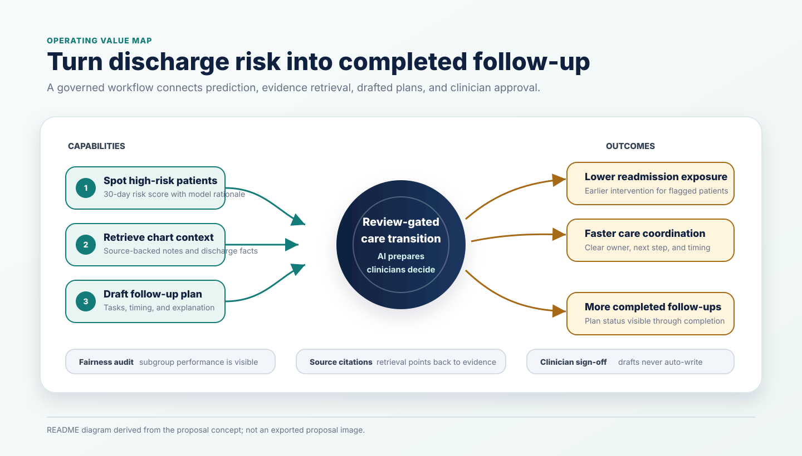
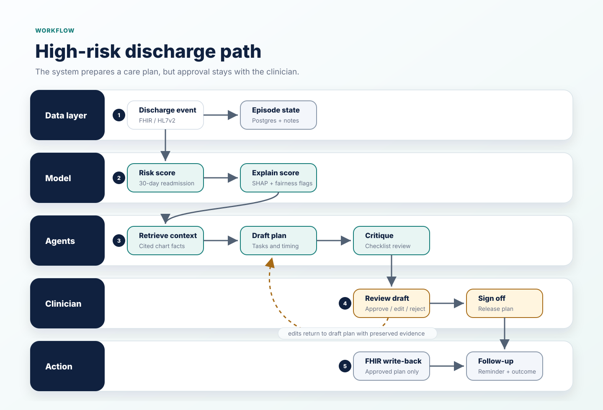
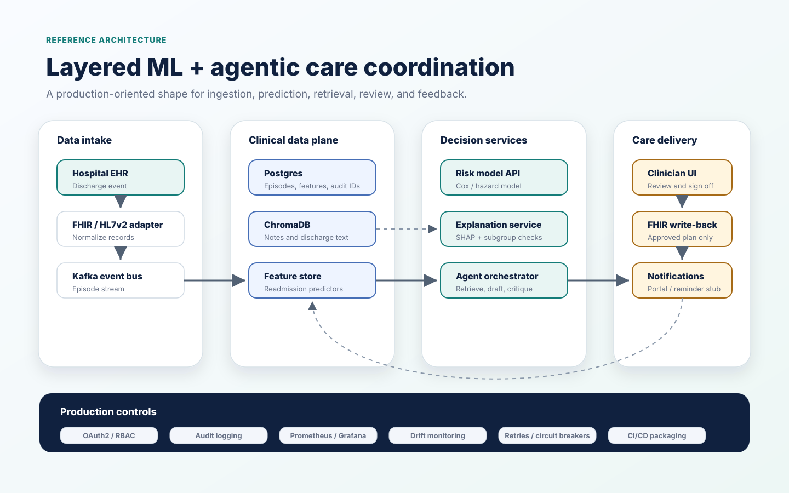
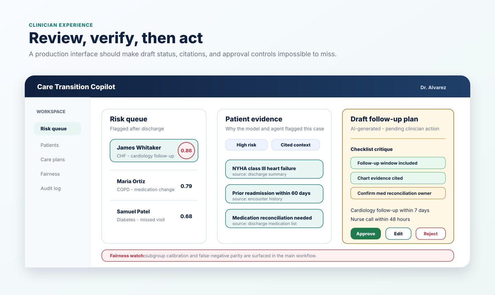

# Care Transition Copilot

An AI system that predicts 30-day hospital readmission risk, retrieves the
relevant patient context, and drafts a personalized follow-up plan, with a
clinician reviewing and approving every plan before it reaches a patient
record.

## Problem

Hospitals often know which discharged patients are at elevated readmission risk,
but the risk score, patient context, and follow-up plan usually live in separate
systems. This project connects those pieces into one workflow: predict who is at
risk, retrieve the clinical context, draft a follow-up plan, and route it through
clinician review before action.

## What this is

Three layers, each doing the job it is suited for:

- **ML** - a survival/hazard model scores readmission risk and is audited for
  fairness across patient subgroups.
- **Agents** - a retrieval agent pulls chart context; a coordinated agent
  workflow drafts a follow-up plan and runs it through checklist-based critique.
- **Human review** - nothing reaches the patient or their record without
  explicit clinician sign-off in the web app.

The system is designed to move four outcomes together: fewer avoidable
readmissions, lower readmission costs, faster care coordination, and more
completed follow-ups. The value comes from connecting risk stratification,
context retrieval, plan drafting, and clinician approval into one operational
loop.



## Documentation and diagrams

- Proposal: `Docs/Care_Transition_Copilot_Proposal.docx`
- Data documentation: `Docs/data_documentation.md`
- Business value diagram: `Docs/readme_business_value.svg`
- Workflow diagram: `Docs/readme_workflow.svg`
- Architecture diagram: `Docs/readme_architecture.svg`
- Clinician review diagram: `Docs/readme_clinician_review.svg`
- Source reference flowchart: `Docs/stakeholder_flowchart.png`

## How it works



1. A discharge event enters the system.
2. The risk model scores the patient's chance of readmission within 30 days.
3. High-risk patients trigger chart retrieval and follow-up plan drafting.
4. A second model critiques the draft against fixed safety and completeness
   checks.
5. A clinician approves, edits, or rejects the plan.
6. Approved plans are written back to the record and used for patient follow-up.
7. Outcomes feed back into the data layer for monitoring and improvement.

## Architecture



- **Data** - FHIR/HL7v2 discharge events flow through Kafka into Postgres for
  structured data and ChromaDB for clinical text retrieval.
- **Prediction** - a scikit-survival or lifelines model scores readmission risk,
  with SHAP explanations and Fairlearn/Aequitas subgroup audits.
- **Agents** - LangGraph coordinates retrieval, care-plan drafting, critique,
  explanation, and clinician handoff.
- **Review and action** - a clinician-facing app keeps AI output in draft state
  until approval, then writes the plan back through FHIR and sends follow-up
  notifications.
- **Platform services** - OAuth2/RBAC, audit logging, monitoring, CI/CD, drift
  checks, retries, and circuit breakers support the workflow.

## Application scope

The MVP focuses on four user-facing capabilities:

- Risk scoring for recently discharged patients.
- Clinical context retrieval with source citations.
- Care-plan orchestration with draft, critique, and explanation steps.
- Clinician actions to approve, edit, reject, notify, or open the patient portal.

## Clinician UI



Design principles from the proposal:

- AI-generated care plans are always visibly drafts until a clinician acts.
- Every risk score and retrieved chart fact should be traceable to its source.
- Fairness alerts belong on the main dashboard, not buried in settings.

## Status
MVP in progress. The proposal scopes a four-week build: synthetic data and
baseline modeling, fairness audit and RAG retrieval, agent orchestration with
failure recovery, then a clinician-facing demo with end-to-end test episodes.

## Getting started

### Prerequisites

- Python 3.11+
- Docker + Docker Compose
- Java 11+ (for Synthea, the synthetic data generator)
- `uv` (or `poetry`) for dependency management

### Setup

```bash
# 1. Clone and enter the repo
git clone <repo-url>
cd care-transition-copilot

# 2. Copy env template and fill in real values
cp .env.example .env

# 3. Start the data layer (Postgres, ChromaDB, Redis)
docker compose up -d

# 4. Install Python dependencies
uv sync   # or: poetry install

# 5. Generate synthetic patient data
./scripts/generate_synthetic_data.sh

# 6. Run the ingestion pipeline on the generated data
python -m src.ingestion.fhir_parser
```

### Running the API

```bash
uvicorn src.api.main:app --reload --port 8080
```

### Running tests

```bash
pytest tests/
```

## Project structure

```text
src/
├── ingestion/    # HL7v2 / FHIR parsing -> canonical DischargeRecord
├── features/     # Feature engineering (comorbidity grouping, med flags, etc.)
├── model/        # Risk model training + SHAP + Fairlearn audit
├── agents/       # LangGraph orchestrator + retrieval/reasoning/critique agents
├── api/          # FastAPI service (Model Serving API)
└── frontend/     # Clinician-facing web app
```

## Data

This project uses **synthetic data only**
([Synthea](https://synthetichealth.github.io/synthea/)) - no real patient data
or data use agreement is required to run or demo it. See
`Docs/data_documentation.md` for the full HL7v2/FHIR schema reference.

## Tech stack

| Layer | Tools |
| --- | --- |
| Risk model | scikit-survival or lifelines, SHAP, Fairlearn or Aequitas |
| API | FastAPI |
| Agents | LangGraph, LlamaIndex or LangChain, Groq/OpenAI-compatible LLMs |
| Data | Postgres, ChromaDB, Redis, Kafka |
| Frontend | React or Streamlit for MVP |
| Notifications | Twilio or patient portal stub |

## Success criteria

- Risk model performance is comparable to published readmission modeling
  baselines.
- Fairness metrics are tracked across patient subgroups.
- Retrieved chart context cites the correct source records in manual test cases.
- The full workflow can flag a patient, retrieve context, draft a plan, explain
  the reasoning, and recover from at least one intentionally failed step.
