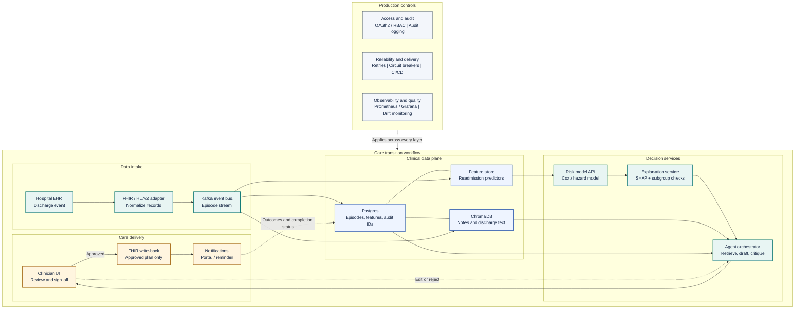

# Care Transition Copilot

An AI system that predicts 30-day hospital readmission risk, retrieves the
relevant patient context, and drafts a personalized follow-up plan, with a
clinician reviewing and approving every plan before it reaches a patient
record.

## Problem

Hospitals often know which discharged patients are at elevated readmission risk,
but the risk score, patient context, and follow-up plan usually live in separate
systems. This project connects those pieces into one workflow: predict who is at
risk, retrieve the clinical context, draft a follow-up plan, and route it through
clinician review before action. 

## What this is

Three layers, each doing the job it is suited for:

- **ML** - a survival/hazard model scores readmission risk and is audited for
  fairness across patient subgroups.
- **Agents** - a retrieval agent pulls chart context; a coordinated agent
  workflow drafts a follow-up plan and runs it through checklist-based critique.
- **Human review** - nothing reaches the patient or their record without
  explicit clinician sign-off in the web app.

The system is designed to move four outcomes together: fewer avoidable
readmissions, lower readmission costs, faster care coordination, and more
completed follow-ups. The value comes from connecting risk stratification,
context retrieval, plan drafting, and clinician approval into one operational
loop.

## How it works


1. A discharge event enters the system.
2. The risk model scores the patient's chance of readmission within 30 days.
3. High-risk patients trigger chart retrieval and follow-up plan drafting.
4. A second model critiques the draft against fixed safety and completeness
   checks.
5. A clinician approves, edits, or rejects the plan.
6. Approved plans are written back to the record and used for patient follow-up.
7. Outcomes feed back into the data layer for monitoring and improvement.

## Target architecture

The diagram below shows the intended end-to-end architecture. The current codebase
has implemented the local synthetic-data, ingestion, feature, target-labeling, and
baseline-modeling pieces first; API serving, agent orchestration, persistence
services, and the clinician UI are still planned work.



- **Implemented data path** - synthetic FHIR bundles are parsed into canonical
  discharge episodes, structured CSV features, and JSONL discharge-note records.
- **Implemented prediction path** - a baseline Cox proportional hazards model
  trains on the labeled positive/negative episodes with a patient-grouped split.
- **Planned agents** - LangGraph will coordinate retrieval, care-plan drafting,
  critique, explanation, and clinician handoff.
- **Planned review and action** - a clinician-facing app will keep AI output in
  draft state until approval, then write the plan back through FHIR and send
  follow-up notifications.
- **Planned platform services** - OAuth2/RBAC, audit logging, monitoring, CI/CD,
  drift checks, retries, and circuit breakers support the workflow.

## Application scope

The MVP focuses on four user-facing capabilities:

- Risk scoring for recently discharged patients.
- Clinical context retrieval with source citations.
- Care-plan orchestration with draft, critique, and explanation steps.
- Clinician actions to approve, edit, reject, notify, or open the patient portal.

## Implemented progress

The current repository shows the first stage of the MVP working locally:

- Parsed inpatient-only Synthea FHIR bundles into a canonical
  `DischargeRecord` schema.
- Clustered raw inpatient encounters into hospitalization episodes so same-stay
  encounters are not counted as readmissions.
- Added time-aware condition and medication filters to avoid using data that was
  not known at discharge.
- Engineered structured predictors: length of stay, age at discharge,
  medication burden, high-risk medication flags, comorbidity categories, prior
  admissions, and protected attributes for later fairness evaluation.
- Exported free-text discharge notes separately to `discharge_notes.jsonl` so
  retrieval work can use notes without leaking text into tabular model inputs.
- Built a rigorous 30-day readmission target with positive, negative, death,
  planned, and excluded outcomes.
- Added a baseline Cox proportional hazards model with a patient-grouped
  train/test split and coefficient/hazard-ratio reporting.

Committed processed data currently includes:

| Artifact | Current contents |
| -------- | -----------------|
| `data/processed/discharge_records.csv` | 3,110 inpatient episodes from 1,341 patients |
| `data/processed/discharge_notes.jsonl` | 3,110 discharge-note records keyed by encounter |
| `data/processed/discharge_records_with_target.csv` | 2,593 negative, 52 positive, 380 planned, 60 death, and 25 excluded outcomes |
| Modeling set | 2,645 positive/negative episodes from 1,328 patients |

## Clinician UI


Design principles from the proposal:

- AI-generated care plans are always visibly drafts until a clinician acts.
- Every risk score and retrieved chart fact should be traceable to its source.
- Fairness alerts belong on the main dashboard, not buried in settings.

## Status

MVP in progress. The data ingestion, feature export, target construction, and
baseline survival model are implemented. Next milestones are fairness auditing,
note chunking/vector indexing, retrieval with citations, agent orchestration,
API serving, and a clinician-facing demo workflow.

## Getting started

### Prerequisites

- Python 3.12+
- `uv` or `pip`
- Java 11+ (for Synthea, the synthetic data generator)
- Docker + Docker Compose for the planned Postgres, ChromaDB, and Redis services

### Setup

```bash
# 1. Clone and enter the repo
git clone <repo-url>
cd care-transition-copilot

# 2. Copy env template and fill in real values
cp .env.example .env

# 3. Install Python dependencies
uv pip install -r requirements.txt
# or:
pip install -r requirements.txt

# 4. Generate synthetic patient data
./scripts/generate_synthetic_data.sh

# 5. Export structured records and discharge notes
python scripts/export_records.py

# 6. Build the 30-day readmission target
python -m src.features.target

# 7. Train and inspect the baseline survival model
python -m src.model.train_baseline
```

### Useful analysis scripts

```bash
python scripts/EDA.py
python scripts/check_resources.py
python scripts/check_comorbidity.py
python scripts/check_multicollinearity.py
```

### Running tests

Automated tests have not been added yet. Current validation is done through the
analysis scripts above and manual inspection of sample inpatient bundles.

## Project structure

```text
src/
|-- ingestion/    # FHIR parsing, temporal filters, episode clustering
|-- features/     # 30-day target construction
|-- model/        # Baseline Cox model training and interpretation
`-- utils/        # Config and logging helpers

scripts/
|-- export_records.py              # Structured CSV + notes JSONL export
|-- EDA.py                         # Exploratory checks on processed records
|-- check_resources.py             # Raw FHIR resource inventory
|-- check_comorbidity.py           # Feature sanity checks
`-- check_multicollinearity.py     # Correlation diagnostics

data/
|-- samples/                       # Example synthetic patient bundles
|-- samples_inpatient/             # Inpatient-focused review samples
`-- processed/                     # CSV/JSONL outputs used by modeling
```

## Data

This project uses **synthetic data only**
([Synthea](https://synthetichealth.github.io/synthea/)) - no real patient data
or data use agreement is required to run or demo it. See
`Docs/data_documentation.md` for the full HL7v2/FHIR schema reference.

## Tech stack

| Layer | Tools |
| --- | --- |
| Implemented ingestion/modeling | pandas, scikit-survival, scikit-learn, Synthea FHIR JSON |
| Planned API | FastAPI, Uvicorn |
| Planned agents/retrieval | LangGraph, LlamaIndex or LangChain, ChromaDB, Groq/OpenAI-compatible LLMs |
| Planned data services | Postgres, Redis, Kafka |
| Planned frontend | React or Streamlit for MVP |
| Planned notifications | Twilio or patient portal stub |

## Success criteria

- Risk model performance is comparable to published readmission modeling
  baselines.
- Fairness metrics are tracked across patient subgroups.
- Retrieved chart context cites the correct source records in manual test cases.
- The full workflow can flag a patient, retrieve context, draft a plan, explain
  the reasoning, and recover from at least one intentionally failed step.
