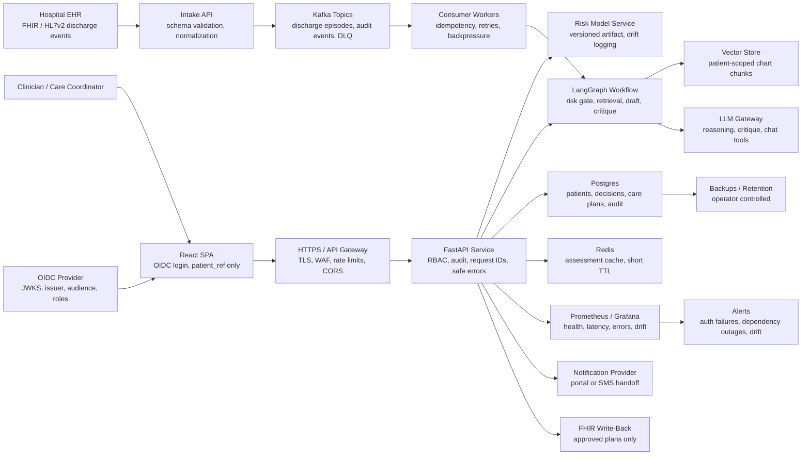

# Care Transition Copilot

[](../../actions/workflows/ci.yml)
[](https://www.python.org/downloads/)
[](LICENSE)

Care Transition Copilot is a synthetic-data healthcare AI demo that scores
30-day readmission risk, retrieves patient-specific chart context, drafts a
care-transition plan, and keeps a clinician in control before anything is
approved.

> Research and demo software only. Not for clinical use, not HIPAA validated,
> and not yet approved for real patient data or protected health information.

## Preview


## What It Does

- Scores recent discharges with a Cox survival model served by FastAPI.
- Retrieves section-aware discharge-note context from a patient-scoped ChromaDB
  vector store.
- Uses a LangGraph agent flow to draft and critique care-transition plans.
- Requires clinician approve/reject decisions before report generation or
  handoff records.
- Supports local API-key demo mode and OIDC/RBAC mode for deployed user access.
- Records audit events, decisions, care plans, notifications, FHIR write-back
  stubs, follow-ups, reminders, metrics, and optional Kafka events.

## Production-Grade Target Architecture

The repo runs locally today, but the intended production shape separates the
browser, API, AI workflow, model serving, event processing, storage, and
observability boundaries. Real clinical deployment would also require security,
privacy, compliance, and clinical validation before PHI or patient care use.


```mermaid
flowchart LR
    clinician["Clinician / Care Coordinator"] --> web["React SPA<br/>OIDC login, patient_ref only"]
    idp["OIDC Provider<br/>JWKS, issuer, audience, roles"] --> web
    web --> gateway["HTTPS / API Gateway<br/>TLS, WAF, rate limits, CORS"]
    gateway --> api["FastAPI Service<br/>RBAC, audit, request IDs, safe errors"]

    ehr["Hospital EHR<br/>FHIR / HL7v2 discharge events"] --> intake["Intake API<br/>schema validation, normalization"]
    intake --> kafka["Kafka Topics<br/>discharge episodes, audit events, DLQ"]
    kafka --> worker["Consumer Workers<br/>idempotency, retries, backpressure"]

    api --> model["Risk Model Service<br/>versioned artifact, drift logging"]
    api --> workflow["LangGraph Workflow<br/>risk gate, retrieval, draft, critique"]
    worker --> workflow
    workflow --> vector["Vector Store<br/>patient-scoped chart chunks"]
    workflow --> llm["LLM Gateway<br/>reasoning, critique, chat tools"]

    api --> db["Postgres<br/>patients, decisions, care plans, audit"]
    api --> cache["Redis<br/>assessment cache, short TTL"]
    api --> metrics["Prometheus / Grafana<br/>health, latency, errors, drift"]
    api --> notify["Notification Provider<br/>portal or SMS handoff"]
    api --> ehrWrite["FHIR Write-Back<br/>approved plans only"]

    db --> backup["Backups / Retention<br/>operator controlled"]
    metrics --> alerts["Alerts<br/>auth failures, dependency outages, drift"]
```

| Boundary | Production expectation |
| --- | --- |
| Identity and access | OIDC with signed access tokens, route-level RBAC, no browser service secrets |
| API edge | HTTPS, restricted CORS, request IDs, safe error responses, rate limits/WAF |
| Data protection | Postgres/managed storage, encrypted backups, retention/deletion policy, no PHI in frontend logs |
| AI safety | Risk-gated workflow, patient-scoped retrieval, critique step, clinician approval before handoff |
| Event processing | Kafka topics, idempotent consumers, retries, dead-letter queue, backpressure controls |
| Model operations | Versioned artifacts, prediction logs, drift report, fairness audit, calibration before clinical use |
| Observability | Health checks, Prometheus metrics, Grafana dashboards, alerts, redacted traces |
| External integrations | EHR write-back, notification provider, and LLM provider approved through security/privacy review |

Current local stubs intentionally keep real EHR write-back, automated reminder
dispatch, managed secrets, hosted alerting, and production deployment outside
the demo boundary. See [ARCHITECTURE.md](ARCHITECTURE.md) and
[SECURITY.md](SECURITY.md) for the deeper design.

## Current Status

| Area | Status |
| --- | --- |
| Synthetic FHIR/HL7 ingestion | Implemented |
| 30-day readmission target and baseline model | Implemented; diagnostic only |
| Fairness audit | Implemented; currently inconclusive at this dataset size |
| Retrieval and vector store | Implemented locally |
| Agent drafting and critique | Implemented with Groq-hosted models |
| Clinician React UI | Implemented locally |
| API-key and OIDC/RBAC auth | Implemented |
| Postgres, Redis, Kafka, Twilio, Prometheus/Grafana | Optional local integrations |
| Real EHR write-back and automated reminders | Stubbed/planned |
| Managed production deployment | Planned |

## Quick Start

### Prerequisites

- Python 3.12+
- `uv` or `pip`
- Node.js 20+
- Java 11+ if regenerating Synthea data
- Docker + Docker Compose for optional Postgres, Redis, Kafka, or observability
- `GROQ_API_KEY`, `API_KEY`, and matching `VITE_API_KEY` in `.env`

Copy the environment template first:

```bash
cp .env.example .env
```

### Install Python Dependencies

Use either dependency path. The repo keeps both because `requirements.txt` is
the operational install path, while `pyproject.toml` supports uv-native project
workflows.

```bash
# Option A: requirements.txt with uv
uv venv
uv pip install -r requirements.txt
uv pip install -e .
```

```bash
# Option B: pyproject.toml with uv
uv sync --dev
```

```bash
# Option C: pip
python -m venv .venv
. .venv/bin/activate
pip install -r requirements.txt
pip install -e .
```

On PowerShell, activate with:

```powershell
.venv\Scripts\Activate.ps1
```

### Build Data and Model Artifacts

If your checkout already has local generated artifacts, you can skip to running
the app. For a clean clone, rebuild them:

```bash
./scripts/generate_synthetic_data.sh
python scripts/export_records.py
python -m src.features.target
python -m src.model.run_experiment --alpha 1.0 --notes "baseline, 6 features"
python -m src.embeddings.build_vector_store
python -m src.embeddings.validate_vector_store
```

### Run the API and Web App

From WSL or macOS/Linux:

```bash
bash dev.sh
```

From PowerShell:

```powershell
cd web
npm run dev:full:win
```

Open `http://127.0.0.1:5173/`.

## API Smoke Test

Start FastAPI if you are not using `dev.sh`:

```bash
uvicorn src.api.main:app --reload --port 8080
```

Then check the service:

```bash
curl http://127.0.0.1:8080/health
curl -H "X-API-Key: $API_KEY" http://127.0.0.1:8080/model-info
```

Example prediction:

```bash
curl -X POST http://127.0.0.1:8080/predict \
  -H "Content-Type: application/json" \
  -H "X-API-Key: $API_KEY" \
  -d '{
    "age_at_discharge": 72,
    "length_of_stay_days": 5,
    "medication_count": 9,
    "prior_admissions_90d": 1,
    "med_flag_diuretic": true,
    "med_flag_anticoagulant": false
  }'
```

## Common Commands

```bash
# Run all automated checks used by CI
bash scripts/check.sh

# Windows equivalent
powershell -ExecutionPolicy Bypass -File scripts/check.ps1

# Run API only
bash dev.sh --api-only

# Run selected model diagnostics
python -m src.model.compare_models
python -m src.model.fairness_audit

# Run the agent pipeline for one patient
python -m src.agents.orchestrator <patient_id>

# Start local observability
docker compose -f docker-compose.observability.yml up
```

## Project Structure

```text
src/
|-- agents/         # Risk tool, retrieval, reasoning, critique, chat, orchestration
|-- api/            # FastAPI app, auth, persistence, metrics, drift, reports
|-- data_services/  # Kafka, notifications, idempotency, runtime data services
|-- embeddings/     # Note chunking and ChromaDB build/validation
|-- features/       # Readmission target construction
|-- ingestion/      # FHIR/HL7 parsing, temporal filters, episode clustering
|-- model/          # Training, comparison, experiment registry, fairness audit
`-- retrieval/      # Patient-scoped vector queries

web/
|-- src/            # React clinician UI
`-- package.json    # Vite scripts

database/           # Postgres migration and verification helpers
Docs/               # Architecture, detailed README, data docs, diagrams
tests/              # Unit and integration-style regression tests
```

## Documentation

- [Detailed implementation notes](Docs/README_DETAILED.md)
- [Architecture](ARCHITECTURE.md)
- [Security model](SECURITY.md)
- [Data card](Docs/DATA_CARD.md)
- [Model card](Docs/MODEL_CARD.md)
- [Changelog](CHANGELOG.md)
- [FHIR/HL7 data documentation](Docs/data_documentation.md)
- [Database migration notes](database/README.md)

## Data and Model Limits

This repo uses synthetic Synthea data only. The current modeling workflow is
diagnostic: the available readmission event count is small, the risk score is a
relative model output rather than a calibrated probability, and subgroup
fairness results are not yet statistically determinate.

Before any real clinical or PHI use, the project would need clinical validation,
calibration, privacy review, security review, deployment hardening, monitoring,
retention/deletion workflows, and approved integrations with the target EHR and
model providers.

## Contributing

Issues and pull requests should use synthetic data only. See
[CONTRIBUTING.md](CONTRIBUTING.md), [CODE_OF_CONDUCT.md](CODE_OF_CONDUCT.md),
and [SECURITY.md](SECURITY.md) before opening changes that touch auth, patient
data flow, model behavior, or generated clinical text.

## License

MIT. See [LICENSE](LICENSE).
