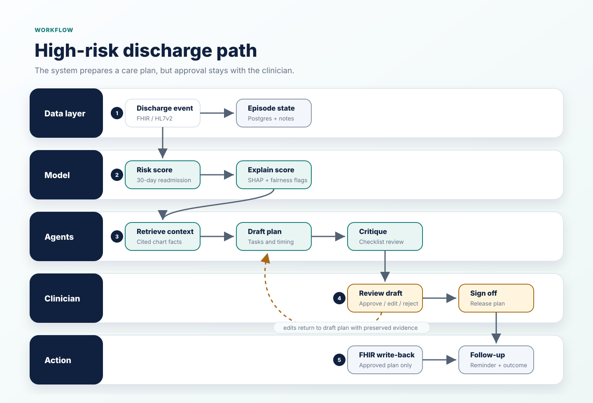
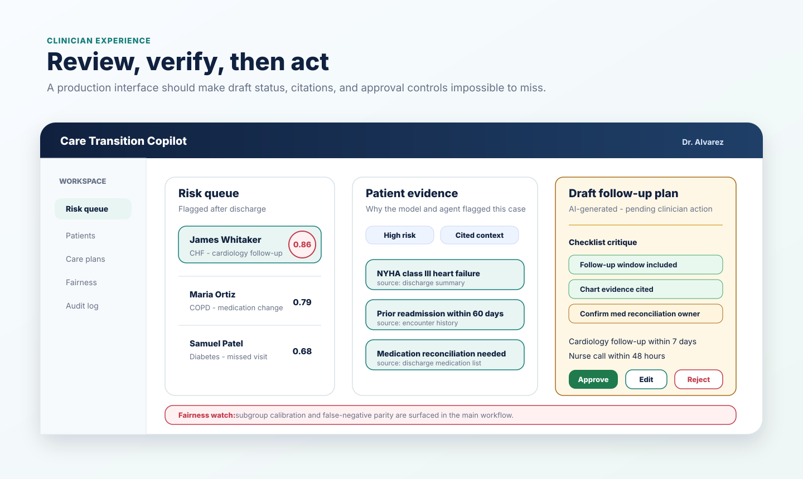
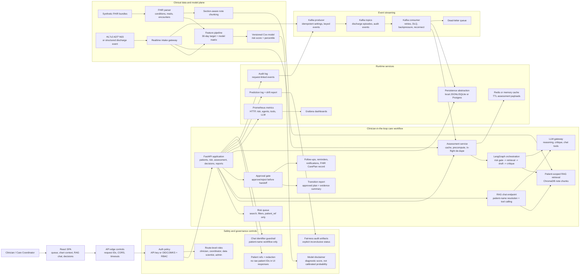

# Care Transition Copilot

[](https://www.python.org/downloads/)
[](web/)
[](web/src/styles.css)
[](web/index.html)
[](scripts/)
[](scripts/)
[](LICENSE)

Care Transition Copilot is a synthetic-data healthcare AI demo that scores
30-day readmission risk, uses retrieval-augmented generation (RAG) over
patient-specific chart context, drafts a care-transition plan, powers a
RAG-backed clinician chat experience, and keeps a clinician in control before
anything is approved.

> Research and demo software only. Not for clinical use, not HIPAA validated,
> and not yet approved for real patient data or protected health information.

## Preview





## What It Does

- Presents a clinician work queue for recent discharge episodes, with search,
  filtering, patient history, risk category, review status, and precomputed
  care-plan state.
- Scores 30-day readmission risk through a versioned Cox survival model served
  by FastAPI, with feature validation generated from the configured model run.
- Parses synthetic FHIR bundles and HL7v2 ADT discharge messages into discharge
  episodes, derives risk features, and can trigger proactive assessment
  generation from intake events.
- Retrieves section-aware discharge-note context from a patient-scoped ChromaDB
  vector store so generated plans and chat answers are grounded in the selected
  patient record.
- Runs a LangGraph workflow that gates by risk, retrieves chart evidence,
  drafts a care-transition plan, and critiques the draft before clinician
  review.
- Provides a RAG-backed web chat that resolves patients by name, calls
  retrieval/risk tools, answers chart-specific follow-up questions, and avoids
  exposing raw patient IDs in the browser.
- Requires clinician approve/reject decisions before transition reports,
  follow-up tracking, reminders, notifications, or FHIR CarePlan write-back
  records are created.
- Supports API-key demo auth and OIDC/RBAC mode, with route-level role policy,
  restricted CORS, request IDs, safe error responses, patient references, and
  chat guardrails that reject raw patient identifiers.
- Persists decisions, care plans, audit events, prediction logs, notifications,
  FHIR write-back records, follow-ups, and reminders through local stores or a
  Postgres-backed runtime.
- Publishes Kafka audit and discharge events with idempotent producer settings;
  the consumer adds retries, duplicate suppression, DLQ routing, backpressure,
  reconnect handling, and graceful shutdown.
- Exposes health, dependency readiness, Prometheus metrics, drift reports,
  fairness audit outputs, LangSmith tracing hooks, and Grafana dashboards for
  operational review.
- Uses Redis or in-memory assessment caching, startup/on-demand precompute
  workers, in-flight request coalescing, bounded API limits, frontend timeouts,
  and LLM burst pacing to keep the MVP responsive during demos.

## MVP Architecture

The MVP is built as a production-shaped clinical workflow, not a single script:
the browser, API, model serving, agent orchestration, retrieval, persistence,
event streaming, observability, and integration adapters are separated so each
boundary can be operated, tested, and replaced independently.


```mermaid
flowchart LR
    clinician["Clinician / Care Coordinator"] --> web["React SPA<br/>queue, chart context, RAG chat, decisions"]
    web --> apiEdge["API edge controls<br/>request IDs, CORS, timeouts"]
    apiEdge --> auth["Auth policy<br/>API key or OIDC/JWKS + RBAC"]
    auth --> api["FastAPI application<br/>patients, risk, assessment, decisions, reports"]

    subgraph ClinicalFlow["Clinician-in-the-loop care workflow"]
        api --> queue["Risk queue<br/>search, filters, patient_ref only"]
        api --> assessment["Assessment service<br/>cache, precompute, in-flight de-dupe"]
        assessment --> workflow["LangGraph orchestration<br/>risk gate -> retrieval -> draft -> critique"]
        api --> chat["RAG chat endpoint<br/>patient-name resolution + tool calling"]
        workflow --> retrieval["Patient-scoped RAG retrieval<br/>ChromaDB note chunks"]
        chat --> retrieval
        workflow --> llm["LLM gateway<br/>reasoning, critique, chat tools"]
        chat --> llm
        api --> approval["Approval gate<br/>approve/reject before handoff"]
        approval --> report["Transition report<br/>approved plan + evidence summary"]
        approval --> followup["Follow-ups, reminders,<br/>notifications, FHIR CarePlan record"]
    end

    subgraph DataPlane["Clinical data and model plane"]
        fhir["Synthetic FHIR bundles"] --> ingestion["FHIR parser<br/>conditions, meds, encounters"]
        hl7["HL7v2 ADT^A03<br/>or structured discharge event"] --> intake["Realtime intake gateway"]
        ingestion --> features["Feature pipeline<br/>30-day target + model matrix"]
        features --> model["Versioned Cox model<br/>risk score + percentile"]
        ingestion --> chunks["Section-aware note chunking"]
        chunks --> retrieval
        intake --> features
        intake --> assessment
    end

    subgraph Runtime["Runtime services"]
        api --> store["Persistence abstraction<br/>local JSONL/SQLite or Postgres"]
        assessment --> cache["Redis or memory cache<br/>TTL assessment payloads"]
        api --> metrics["Prometheus metrics<br/>HTTP, risk, agents, tools, LLM"]
        metrics --> grafana["Grafana dashboards"]
        api --> drift["Prediction log + drift report"]
        api --> audit["Audit log<br/>request-linked events"]
    end

    subgraph Streaming["Event streaming"]
        intake --> producer["Kafka producer<br/>idempotent settings, keyed events"]
        audit --> producer
        producer --> topics["Kafka topics<br/>discharge episodes, audit events"]
        topics --> consumer["Kafka consumer<br/>retries, DLQ, backpressure, reconnect"]
        consumer --> assessment
        consumer --> store
        consumer --> dlq["Dead-letter queue"]
    end

    subgraph Safety["Safety and governance controls"]
        auth --> roles["Route-level roles<br/>clinician, coordinator, data scientist, admin"]
        api --> redaction["Patient refs + redaction<br/>no raw patient IDs in UI responses"]
        api --> guardrails["Chat identifier guardrail<br/>patient-name workflow only"]
        model --> disclaimer["Model disclaimer<br/>diagnostic score, not calibrated probability"]
        drift --> fairness["Fairness audit artifacts<br/>explicit inconclusive status"]
    end
```

The API layer owns authentication, role checks, request correlation, CORS,
error shaping, patient-reference redaction, and runtime dependency reporting.
The RAG layer is shared by the automated care-plan workflow and the web chat:
both retrieve patient-scoped note chunks before generating answers, while chat
adds patient-name resolution and tool-calling for risk, medication, and chart
questions. The model layer remains versioned and auditable: predictions are
logged, drift can be computed against the training reference distribution, and
fairness results are documented as inconclusive at the current synthetic dataset
size.

The runtime can stay lightweight for local demos or switch to managed-style
services through environment configuration: Postgres for decisions, care plans,
audit events, notifications, FHIR write-back records, follow-ups, reminders,
and prediction logs; Redis for assessment cache; Kafka for discharge/audit
streams; Prometheus and Grafana for metrics; LangSmith for trace capture; and
Twilio SMS or a portal-stub channel for notifications. FHIR write-back is
represented as a persisted CarePlan resource record after clinician approval,
which keeps the handoff path reviewable without sending real patient data to an
external EHR.

## Current Status

| Area | Status |
| --- | --- |
| Synthetic FHIR/HL7 ingestion | Implemented |
| 30-day readmission target and baseline model | Implemented; diagnostic only |
| Fairness audit | Implemented; currently inconclusive at this dataset size |
| RAG retrieval and vector store | Implemented locally with patient-scoped ChromaDB chunks |
| Agent drafting and critique | Implemented with Groq-hosted models |
| Clinician React UI | Implemented locally with queue, approvals, operations, and RAG chat |
| API-key and OIDC/RBAC auth | Implemented |
| Postgres, Redis, Kafka, Twilio, Prometheus/Grafana | Configurable runtime integrations |
| FHIR write-back and reminders | Persisted records after clinician approval; no external EHR write is sent |
| Deployment posture | Local MVP with production-shaped service boundaries |

## Quick Start

### Prerequisites

- Python 3.12+
- `uv` or `pip`
- Node.js 20+
- Java 11+ if regenerating Synthea data
- Docker + Docker Compose for optional Postgres, Redis, Kafka, or observability
- `GROQ_API_KEY`, `API_KEY`, and matching `VITE_API_KEY` in `.env`

Copy the environment template first:

```bash
cp .env.example .env
```

### Install Python Dependencies

Use either dependency path. The repo keeps both because `requirements.txt` is
the operational install path, while `pyproject.toml` supports uv-native project
workflows.

```bash
# Option A: requirements.txt with uv
uv venv
uv pip install -r requirements.txt
uv pip install -e .
```

```bash
# Option B: pyproject.toml with uv
uv sync --dev
```

```bash
# Option C: pip
python -m venv .venv
. .venv/bin/activate
pip install -r requirements.txt
pip install -e .
```

On PowerShell, activate with:

```powershell
.venv\Scripts\Activate.ps1
```

### Build Data and Model Artifacts

If your checkout already has local generated artifacts, you can skip to running
the app. For a clean clone, rebuild them:

```bash
./scripts/generate_synthetic_data.sh
python scripts/export_records.py
python -m src.features.target
python -m src.model.run_experiment --alpha 1.0 --notes "baseline, 6 features"
python -m src.embeddings.build_vector_store
python -m src.embeddings.validate_vector_store
```

### Run the API and Web App

From WSL or macOS/Linux:

```bash
bash dev.sh
```

From PowerShell:

```powershell
cd web
npm run dev:full:win
```

Open `http://127.0.0.1:5173/`.

## API Smoke Test

Start FastAPI if you are not using `dev.sh`:

```bash
uvicorn src.api.main:app --reload --port 8080
```

Then check the service:

```bash
curl http://127.0.0.1:8080/health
curl -H "X-API-Key: $API_KEY" http://127.0.0.1:8080/model-info
```

Example prediction:

```bash
curl -X POST http://127.0.0.1:8080/predict \
  -H "Content-Type: application/json" \
  -H "X-API-Key: $API_KEY" \
  -d '{
    "age_at_discharge": 72,
    "length_of_stay_days": 5,
    "medication_count": 9,
    "prior_admissions_90d": 1,
    "med_flag_diuretic": true,
    "med_flag_anticoagulant": false
  }'
```

## Common Commands

```bash
# Run all automated checks used by CI
bash scripts/check.sh

# Windows equivalent
powershell -ExecutionPolicy Bypass -File scripts/check.ps1

# Run API only
bash dev.sh --api-only

# Run selected model diagnostics
python -m src.model.compare_models
python -m src.model.fairness_audit

# Run the agent pipeline for one patient
python -m src.agents.orchestrator <patient_id>

# Start local observability
docker compose -f docker-compose.observability.yml up
```

## Project Structure

```text
src/
|-- agents/         # Risk tool, retrieval, reasoning, critique, chat, orchestration
|-- api/            # FastAPI app, auth, persistence, metrics, drift, reports
|-- data_services/  # Kafka, notifications, idempotency, runtime data services
|-- embeddings/     # Note chunking and ChromaDB build/validation
|-- features/       # Readmission target construction
|-- ingestion/      # FHIR/HL7 parsing, temporal filters, episode clustering
|-- model/          # Training, comparison, experiment registry, fairness audit
`-- retrieval/      # Patient-scoped vector queries

web/
|-- src/            # React clinician UI
`-- package.json    # Vite scripts

database/           # Postgres migration and verification helpers
Docs/               # Architecture, detailed README, data docs, diagrams
tests/              # Unit and integration-style regression tests
```

## Documentation

- [Detailed implementation notes](Docs/README_DETAILED.md)
- [Architecture](ARCHITECTURE.md)
- [Security model](SECURITY.md)
- [Data card](Docs/DATA_CARD.md)
- [Model card](Docs/MODEL_CARD.md)
- [Changelog](CHANGELOG.md)
- [FHIR/HL7 data documentation](Docs/data_documentation.md)
- [Database migration notes](database/README.md)

## Data and Model Limits

This repo uses synthetic Synthea data only. The current modeling workflow is
diagnostic: the available readmission event count is small, the risk score is a
relative model output rather than a calibrated probability, and subgroup
fairness results are not yet statistically determinate.

Before any real clinical or PHI use, the project would need clinical validation,
calibration, privacy review, security review, deployment hardening, monitoring,
retention/deletion workflows, and approved integrations with the target EHR and
model providers.

## Contributing

Issues and pull requests should use synthetic data only. See
[CONTRIBUTING.md](CONTRIBUTING.md), [CODE_OF_CONDUCT.md](CODE_OF_CONDUCT.md),
and [SECURITY.md](SECURITY.md) before opening changes that touch auth, patient
data flow, model behavior, or generated clinical text.

## License

MIT. See [LICENSE](LICENSE).
