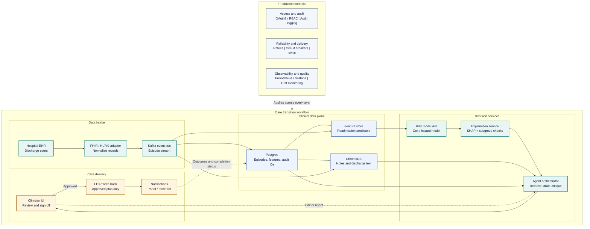

# Care Transition Copilot

An AI system that predicts 30-day hospital readmission risk, retrieves the
relevant patient context, and drafts a personalized follow-up plan, with a
clinician reviewing and approving every plan before it reaches a patient
record.

## Problem

Hospitals often know which discharged patients are at elevated readmission risk,
but the risk score, patient context, and follow-up plan usually live in separate
systems. This project connects those pieces into one workflow: predict who is at
risk, retrieve the clinical context, draft a follow-up plan, and route it through
clinician review before action. 

## What this is

Three layers, each doing the job it is suited for:

- **ML** - a survival/hazard model scores readmission risk and is audited for
  fairness across patient subgroups.
- **Agents** - a retrieval agent pulls chart context; a coordinated agent
  workflow drafts a follow-up plan and runs it through checklist-based critique.
- **Human review** - nothing reaches the patient or their record without
  explicit clinician sign-off in the web app.

The system is designed to move four outcomes together: fewer avoidable
readmissions, lower readmission costs, faster care coordination, and more
completed follow-ups. The value comes from connecting risk stratification,
context retrieval, plan drafting, and clinician approval into one operational
loop.

## How it works


1. A discharge event enters the system.
2. The risk model scores the patient's chance of readmission within 30 days.
3. High-risk patients trigger chart retrieval and follow-up plan drafting.
4. A second model critiques the draft against fixed safety and completeness
   checks.
5. A clinician approves, edits, or rejects the plan.
6. Approved plans are written back to the record and used for patient follow-up.
7. Outcomes feed back into the data layer for monitoring and improvement.

## Target architecture

The diagram below shows the intended end-to-end architecture. The current
codebase has implemented the local synthetic-data, ingestion, feature,
target-labeling, baseline/model-comparison, experiment registry, fairness-audit,
section-aware note chunking, vector-store indexing, risk-model API,
risk-model-to-agent integration, dynamic retrieval categories, reasoning agent,
critique agent, risk-gated LangGraph orchestration, free-form tool-calling chat
agent, a React clinician UI, API-key or OIDC bearer-token protection,
episode-specific assessments cached in memory or Redis, configurable
local-or-database persistence, Postgres migration/verification scripts, saved
draft care-plan records, approve/reject decisions, real-time HL7/structured
discharge intake, Kafka producers, and a persistent Kafka consumer with DLQ and
idempotency handling. Full EHR write-back, managed deployments, and production
monitoring are still planned work.


```mermaid
flowchart TB
    subgraph Pipeline["Care transition workflow"]
        direction LR

        subgraph Intake["Data intake"]
            direction TB
            ehr["Hospital EHR<br/>Discharge event"]
            adapter["FHIR / HL7v2 adapter<br/>Normalize records"]
            kafka["Kafka event bus<br/>Episode stream"]
            ehr --> adapter --> kafka
        end

        subgraph Data["Clinical data plane"]
            direction TB
            postgres["Postgres<br/>Episodes, features, audit IDs"]
            chroma["ChromaDB<br/>Notes and discharge text"]
            features["Feature store<br/>Readmission predictors"]
            postgres --- chroma
            postgres --- features
        end

        subgraph Decision["Decision services"]
            direction TB
            model["Risk model API<br/>Cox / hazard model"]
            explain["Explanation service<br/>SHAP + subgroup checks"]
            agents["Agent orchestrator<br/>Retrieve, draft, critique"]
            model --> explain --> agents
        end

        subgraph Delivery["Care delivery"]
            direction TB
            clinician["Clinician UI<br/>Review and sign off"]
            fhir["FHIR write-back<br/>Approved plan only"]
            notify["Notifications<br/>Portal / reminder"]
            clinician -->|Approved| fhir --> notify
        end
    end

    kafka --> postgres
    kafka --> chroma
    kafka --> features
    features --> model
    chroma --> agents
    postgres --> agents
    agents --> clinician
    notify -. Outcomes and completion status .-> postgres
    clinician -. Edit or reject .-> agents

    subgraph Controls["Production controls"]
        direction LR
        security["Access and audit<br/>OAuth2 / RBAC | Audit logging"]
        operations["Reliability and delivery<br/>Retries | Circuit breakers | CI/CD"]
        quality["Observability and quality<br/>Prometheus / Grafana | Drift monitoring"]
    end

    Controls -. Applies across every layer .-> Pipeline

    classDef intake fill:#e8f5f3,stroke:#147c78,color:#10213f,stroke-width:2px;
    classDef data fill:#eef4ff,stroke:#466eb6,color:#10213f,stroke-width:2px;
    classDef decision fill:#e8f5f3,stroke:#147c78,color:#10213f,stroke-width:2px;
    classDef delivery fill:#fff5df,stroke:#a66a16,color:#10213f,stroke-width:2px;
    classDef control fill:#f3f6fb,stroke:#526174,color:#10213f,stroke-width:1px;

    class ehr,adapter,kafka intake;
    class postgres,chroma,features data;
    class model,explain,agents decision;
    class clinician,fhir,notify delivery;
    class security,operations,quality control;
```

- **Implemented data path** - synthetic FHIR bundles are parsed into canonical
  discharge episodes, structured CSV features, and JSONL discharge-note records.
- **Implemented prediction path** - a baseline Cox proportional hazards model
  trains on the labeled positive/negative episodes with a patient-grouped split.
  Model-comparison diagnostics evaluate Cox, Random Survival Forest, and
  Gradient Boosting survival configurations with patient-grouped
  cross-validation. The current configured production run is
  `20260915_113931_cdd23e`.
- **Implemented serving path** - FastAPI serves the configured saved model, builds
  the `/predict` request schema from that model's saved feature list, logs live
  predictions, and exposes a drift report against the training reference
  distribution.
- **Implemented real-time intake path** - FastAPI accepts raw HL7v2 ADT^A03
  discharge messages through `POST /intake/hl7-adt` and structured discharge
  triggers through `POST /intake/discharge-event`, derives model features,
  scores risk, optionally starts care-plan precomputation, and publishes the
  normalized episode to Kafka when enabled.
- **Implemented retrieval foundation** - discharge notes are split into
  section-aware chunks, embedded into a local persistent ChromaDB collection, and
  validated with open-corpus and patient-scoped retrieval checks.
- **Implemented agent pipeline** - LangGraph now starts with a live risk-model
  assessment, skips full chart review for low-risk patients, and runs dynamic
  patient-scoped retrieval, Groq-hosted care-plan drafting, and a second-model
  critique step for medium/high-risk patients. The pipeline keeps missing
  documentation explicit instead of smoothing over gaps.
- **Implemented review surface** - the React web app now includes a risk queue,
  Patients view, Care plans view, ad hoc chat interface, and dashboard
  approve/reject actions persisted through the API. Approved plans can generate
  mock care-transition reports, while rejected plans remain marked for edit and
  resubmission.
- **Implemented production safeguards** - the API has safe error handling,
  health dependency reporting, required API-key protection for local demo mode,
  OIDC bearer-token verification with role checks for user access, request
  timeouts, cached assessment generation with optional Redis backing,
  file-based or SQL-backed audit/care-plan persistence, request tracing,
  idempotent care-plan decisions, actor tracking for clinician actions,
  Kafka consumer idempotency, and dead-letter routing for malformed or failed
  stream messages.
- **Implemented notification handoff** - approved care plans queue a patient
  portal stub notification by default, or send an SMS through Twilio when the
  optional credentials, package, and recipient number are configured. Delivery
  results are persisted locally or in SQL and never make the decision request
  fail.
- **Planned platform services** - managed deployment, CI/CD, production
  monitoring, circuit breakers, and FHIR write-back remain future hardening
  work.

### Authentication configuration

Local demo mode uses `AUTH_MODE=api_key` and the shared `API_KEY`; it is not an
identity system. For OIDC, set `AUTH_MODE=oidc` and `VITE_AUTH_MODE=oidc`, then
configure `OIDC_ISSUER`, `OIDC_AUDIENCE`, `OIDC_JWKS_URL`, and the matching
`VITE_OIDC_AUTHORITY`, `VITE_OIDC_CLIENT_ID`, and `VITE_OIDC_SCOPE` values.
The identity provider must issue signed RS256 access tokens with the configured
issuer, API audience, subject, expiry, and a `roles` claim (or the configured
`OIDC_ROLES_CLAIM`). Assign `care_coordinator`, `clinician`, `data_scientist`,
or `admin` roles. Add the browser origin to `CORS_ALLOWED_ORIGINS`. In OIDC mode,
the API derives decision attribution from the verified token subject; the
shared API key is reserved for service-to-service `/predict` requests. Role
checks gate model metadata, drift reports, patient lists, care plans, chat,
decisions, and approved report access.

## Application scope

The MVP focuses on four user-facing capabilities:

- Risk scoring for recently discharged patients.
- Clinical context retrieval with source citations.
- Care-plan orchestration with draft, critique, and explanation steps.
- Clinician approve/reject actions for draft care plans plus approved mock
  care-transition report generation; edit, notify, and
  portal handoff remain planned workflow extensions.

## Implemented progress

The current repository shows the first stage of the MVP working locally:

- Parsed inpatient-only Synthea FHIR bundles into a canonical
  `DischargeRecord` schema.
- Clustered raw inpatient encounters into hospitalization episodes so same-stay
  encounters are not counted as readmissions.
- Added time-aware condition and medication filters to avoid using data that was
  not known at discharge.
- Engineered structured predictors: length of stay, age at discharge,
  medication burden, high-risk medication flags, comorbidity categories, prior
  admissions, and protected attributes for later fairness evaluation.
- Exported free-text discharge notes separately to `discharge_notes.jsonl` so
  retrieval work can use notes without leaking text into tabular model inputs.
- Built a rigorous 30-day readmission target with positive, negative, death,
  planned, and excluded outcomes.
- Added a baseline Cox proportional hazards model with a patient-grouped
  train/test split and coefficient/hazard-ratio reporting.
- Added grouped cross-validation for model comparison across regularized Cox,
  Random Survival Forest, and Gradient Boosting Survival Analysis candidates.
  The comparison reports mean C-index, standard deviation, usable fold count,
  and per-fold scores so small-sample variance is visible.
- Added a comorbidity-count diagnostic that compares Cox performance with and
  without `comorbidity_count`, helping decide whether to keep the feature out
  for interpretability or restore it for stronger risk ranking.
- Added a lightweight experiment registry in `results/experiments.csv`, with
  every logged run tied to a saved `models/{run_id}.joblib` artifact. The saved
  model artifacts are regenerable and gitignored.
- Added `src.model.compare_experiments` to compare logged runs side by side and
  flag likely overfitting when the train/test C-index gap is greater than 0.15.
- Added a fairness audit for sex and race subgroup performance. At the current
  event count it is intentionally reported as inconclusive, not as a passed
  fairness validation.
- Added a FastAPI risk-model service with `/health`, `/model-info`, `/predict`,
  and `/drift-report` endpoints. The prediction request schema is generated from
  the loaded model's actual feature list, so changing `model.production_run_id`
  in `config.yaml` updates the served schema on restart.
- Added section-aware discharge-note chunking in `src.embeddings.chunking`.
  Notes are split on clinical headers such as chief complaint, history, and
  assessment/plan instead of embedding whole notes, so secondary conditions are
  not diluted by unrelated note sections.
- Added a local ChromaDB vector-store build in `src.embeddings.build_vector_store`
  and validation in `src.embeddings.validate_vector_store`. The vector database
  is stored at `data/processed/chroma_db/`, is gitignored, and can be rebuilt
  from `data/processed/discharge_notes.jsonl`.
- Added retrieval diagnostics for CHF mention coverage and patient-scoped
  retrieval behavior in `scripts/check_chf_notes.py`,
  `scripts/check_patient_chf_history.py`, and `scripts/test_scoped_retrieval.py`.
- Added patient-scoped retrieval in `src.retrieval.query_store`, including a
  relevance-distance threshold so unrelated chunks are not forced into the
  context when a patient's notes have no genuine match.
- Updated patient-scoped retrieval to over-fetch candidates and suppress
  highly similar note chunks, even when near-duplicate text comes from different
  encounters.
- Added `src.agents.retrieval_agent`, which runs fixed clinical-category
  searches for admission reason, comorbidities, medications, procedures/plan,
  and follow-up, then returns a structured context summary.
- Added dynamic retrieval-category generation in `src.agents.retrieval_agent`.
  The orchestrator can now tailor search queries to the patient's admission
  reason and risk category, while standalone retrieval still falls back to the
  fixed categories if an API key is missing or generation fails.
- Added `src.agents.reasoning_agent`, which uses Groq
  `openai/gpt-oss-120b` by default to draft a grounded three-section care plan:
  risk factors, recommended follow-up actions, and additional review notes.
- Added `src.agents.critique_agent`, which uses Groq `openai/gpt-oss-20b` by
  default to review the draft for hallucination, clinical overreach, and missed
  reviewer-facing caveats before clinician review. The critique input now receives
  the same risk-assessment context as the reasoning agent so valid model risk
  percentiles are not flagged as unsupported chart claims.
- Added `src.agents.risk_tool`, which looks up the patient's latest model
  features from `data/processed/discharge_records_with_target.csv`, calls the
  live FastAPI `/predict` endpoint, and returns risk score, percentile, category,
  and admission reason to the agent graph.
- Updated `src.agents.orchestrator` into a risk-gated LangGraph state machine:
  risk assessment -> low-risk summary, or risk assessment -> dynamic retrieval
  -> reasoning -> critique for medium/high-risk patients.
- Added `src.agents.chat_agent` and `src.agents.tools`, a free-form clinician
  question interface where the LLM decides whether to call the risk assessment
  tool, patient chart search, both, or neither. Tool calls are returned with the
  answer as an audit trail, and chart-search tool guidance now steers the model
  toward validated clinical query phrasings instead of vague searches such as
  "discharge summary."
- Added production-readiness helpers around the API: safe unhandled-error
  responses, required `API_KEY` protection for non-health endpoints, `/health`
  dependency checks, OIDC bearer-token verification with role-based route
  checks, configurable LLM/risk-API timeouts, optional Redis-backed assessment
  caching, file-based audit logging in `results/audit_log.jsonl`, and saved
  generated care plans in `results/care_plans.jsonl`.
- Added the first React clinician workflow beyond the risk queue:
  `/patients` lists recent discharged patients, `/care-plans` lets a user select
  a patient and generate/view a draft follow-up plan, and `/chat` renders
  assistant answers as formatted notes with visible tool-call audit trails.
- Added episode-specific assessment and decision APIs. Assessments now accept an
  optional `discharge_ts`, cache generated agent results for the configured
  `CACHE_TTL_SECONDS` in memory or Redis, and the dashboard can record
  approve/reject decisions to `results/decisions.sqlite3`.
- Added request tracing with `X-Request-ID` across the API and web client so UI
  errors can be matched to server logs. Care-plan decisions are now idempotent
  per patient episode and store the acting clinician label, using the configured
  demo clinician ID in API-key mode or the verified token subject in OIDC mode.
  Persistence can run in local JSONL/SQLite mode or SQL-backed database mode.
- Added approved mock care-transition reports. `GET /patients/{id}/report`
  returns an approved Markdown report and saves it under `reports/` with public
  demo naming such as `care-transition-report__2026-08-09__994d6249.md`.
  Rejected drafts return an edit-required status instead of a finalized report.
- Added post-approval notifications through `src.data_services.notifications`.
  The default local `portal_stub` records a queued notification; optional
  Twilio SMS delivery requires `TWILIO_ACCOUNT_SID`, `TWILIO_AUTH_TOKEN`,
  `TWILIO_FROM_NUMBER`, the `twilio` package, and a recipient number. Delivery
  failures are recorded without failing the approval request, and notification
  records are available through `GET /notifications`.
- Updated the dashboard evidence panel to show cited chart excerpts directly in
  the Patient evidence panel, grouped by retrieval category and source. The
  display layer strips repeated headers, deduplicates repeated clinical items,
  preserves hyphenated clinical terms such as lab names, and separates
  procedures, lab reports, medications, and care-plan entries into readable
  sub-blocks.
- Validated the Patient evidence formatter against live `/patients/{id}/assessment`
  responses and exact real discharge-note excerpts from
  `data/processed/discharge_notes.jsonl`; see `results/RESULTS.md` for the
  before/after details.
- Name suffix digits from synthetic Synthea patients are removed in display only.
- Rebranded the care-plan third section from "Documentation gaps" to
  "Additional review notes" and suppressed raw "no relevant documentation
  found" lines in the UI.
- Added asynchronous background care plan pre-generation in `src/api/precompute.py`.
  High-risk patients can have their draft plans, retrieval context, and critiques
  precomputed upon discharge, at API startup (`PRECOMPUTE_ON_STARTUP=true`), via
  `POST /tasks/precompute-assessments`, or using `scripts/precompute_assessments.py`.
  Precomputed plans are persisted and cached, dropping UI load time from ~10s to <10ms,
  with in-flight request deduplication to prevent duplicate LLM calls.
- Added real-time discharge intake in `src/ingestion/hl7_intake.py` and FastAPI
  endpoints for raw HL7v2 ADT^A03 messages and structured discharge triggers.
  Intake derives risk features, scores the episode, triggers precomputation for
  medium/high-risk patients, publishes a discharge episode event, and writes an
  audit event when Kafka is enabled.
- Added a persistent Kafka consumer in `src/data_services/consumer.py`, with a
  CLI runner at `scripts/run_kafka_consumer.py`. The consumer handles discharge
  episode and audit-event topics, skips duplicate event IDs through
  `src/data_services/idempotency.py`, pauses/resumes polling under backpressure,
  retries handler failures, and routes malformed or exhausted messages to the
  configured DLQ topic.


Committed processed data currently includes:

| Artifact | Current contents |
| -------- | -----------------|
| `data/processed/discharge_records.csv` | 3,110 inpatient episodes from 1,341 patients |
| `data/processed/discharge_notes.jsonl` | 3,110 discharge-note records keyed by encounter |
| `data/processed/discharge_records_with_target.csv` | 2,593 negative, 52 positive, 380 planned, 60 death, and 25 excluded outcomes |
| Modeling set | 2,645 positive/negative episodes from 1,328 patients |

Latest model-comparison summary:

| Model/configuration | Mean C-index | Std | Notes |
| --- | ---: | ---: | --- |
| Cox, `alpha=5.0` | 0.736 | 0.084 | Best cross-validated mean |
| Cox, `alpha=1.0` | 0.732 | 0.085 | Chosen baseline for interpretability and registry/API consistency |
| Best Random Survival Forest | 0.721 | 0.072 | Did not beat Cox enough to justify added complexity |
| Best Gradient Boosting Survival Analysis | 0.691 | 0.091 | Lower mean and higher variance |

The official baseline v1 registry run is `20260915_113931_cdd23e`: Cox
Proportional Hazards, `alpha=1.0`, six features, 1,967 train episodes, 678 test
episodes, 40 train events, 12 test events, and train/test C-index
`0.7757 / 0.6844`. The single split is noisier than the grouped CV summary, so
the README and `results/RESULTS.md` treat the CV comparison as the more reliable
model-selection evidence.

Latest retrieval/vector-store summary:

| Component | Current behavior |
| --- | --- |
| Chunking | Splits discharge notes by markdown-style clinical section headers and drops date-only preambles |
| Short sections | Merges tiny boilerplate sections into neighboring content before embedding |
| Vector store | Builds a persistent ChromaDB collection named `discharge_notes` under `data/processed/chroma_db/` |
| Embeddings | Uses ChromaDB's default local embedding function; first run may download the model cache |
| Patient-scoped querying | Applies a relevance-distance threshold, over-fetches candidates, and removes highly similar chunks before returning context |
| Validation | Runs broad clinical queries and patient-scoped retrieval checks with metadata inspection |

Latest agent-orchestration summary:

| Agent | Current behavior |
| --- | --- |
| Risk tool | Calls the live FastAPI `/predict` endpoint and passes risk category, percentile, score, and admission reason into the agent graph |
| Retrieval | Patient-scoped ChromaDB search with relevance thresholding; fixed categories for standalone use and dynamic categories when orchestrated with risk/admission context |
| Reasoning | Groq-hosted LLM drafts a care-coordination plan from retrieved context plus the validated risk-assessment line |
| Critique | Second Groq-hosted model reviews the draft for hallucination, overreach, and missed gaps while respecting the validated risk-assessment line |
| Orchestrator | LangGraph runs risk assessment first, skips full review for low-risk patients, and runs retrieval -> reasoning -> critique for medium/high-risk patients |
| Chat agent | Groq function-calling interface for ad hoc clinician questions; exposes `assess_readmission_risk` and `search_patient_chart` as auditable tools |
| Production guardrails | Safe API error handling, dependency-aware `/health`, required API key or OIDC bearer token, route-level role checks, request timeouts, request IDs, cached assessments with optional Redis backing, local JSONL/SQLite or SQL-backed persistence, idempotent decisions, and approved report export |
| React clinician UI | Risk queue, Patients, Care plans, Ask a question, API-key demo mode or OIDC login, configurable clinician ID, decision badges with actor labels, approved report preview, and rejected edit-required status |
| Known limitation | Reasoning and critique use different OpenAI open-weight model sizes on Groq, not genuinely independent model providers |

## Clinician UI


Implemented locally in `web/`:

- **Risk queue** - shows recent discharged patients, risk percentile, admission
  reason, and generated patient evidence.
- **Patient evidence** - shows cited chart context used by the agent, with
  repeated headers removed, duplicate clinical bullets collapsed, and procedures,
  labs, medications, and care-plan items formatted under clear subheaders.
- **Draft follow-up plan** - renders the generated plan, critique status, and
  persisted approve/reject decision state. Approved decisions show a generated
  mock care-transition report; rejected decisions show that the draft needs edit
  and resubmission. Edit remains a placeholder.
- **Patients** - lists recent patients from the API with cleaned display names.
- **Care plans** - selects a patient and generates/views their draft plan.
- **Ask a question** - supports free-form patient questions with visible tool
  calls and formatted assistant answers.

Design principles from the proposal:

- AI-generated care plans are always visibly drafts until a clinician acts.
- Every risk score and retrieved chart fact should be traceable to its source.
- Fairness status remains an API/model caveat, but the dashboard no longer shows
  a dedicated fairness banner in the main workflow.

## Status

MVP in progress. The local data, modeling, retrieval foundation, agent pipeline,
serving layer, event-streaming layer, and first clinician-facing web workflow
are now implemented: FHIR ingestion, HL7v2/structured discharge intake,
hospitalization episode construction, feature export, 30-day target labeling,
baseline Cox survival modeling, patient-grouped cross-validation for comparing
Cox, Random Survival Forest, and Gradient Boosting survival candidates,
experiment logging/model saving, fairness-audit infrastructure, section-aware
note chunking, ChromaDB vector-store indexing, FastAPI model serving,
patient-scoped retrieval, risk-model-to-agent integration, dynamic retrieval
categories, grounded care-plan drafting, second-model critique, risk-gated
LangGraph orchestration, an auditable tool-calling chat agent, API-key protected
or OIDC-authenticated serving, cached episode-specific assessment generation
with optional Redis backing, approve/reject decision persistence with local or
SQL-backed storage, Kafka publishing and consumer processing with DLQ/idempotency
support, Postgres migration and verification scripts, request tracing,
idempotent actor-labeled decisions, approved care-transition report export, and
a React UI with risk queue, Patients, Care plans, Ask a question routes,
dashboard clinician decision controls, configurable clinician ID, OIDC
login/logout support, and report preview/status.

The current modeling work is still diagnostic rather than production-ready. The
dataset has only 52 positive readmission events, so the comparison workflow
surfaces mean C-index, fold-to-fold standard deviation, and per-fold scores
instead of treating any single split as definitive. The fairness audit is also
inconclusive at this dataset size because most protected subgroups do not have
enough positive events for a reliable comparison.

Next milestones are scaling the synthetic population for a determinate fairness
audit, calibrating retrieval distance thresholds against labeled relevance
examples, strengthening reasoning/critique model independence, hardening the
OIDC/RBAC deployment path, wiring the care-plan edit workflow, and adding FHIR
write-back/notification stubs.

## Getting started

### Prerequisites

- Python 3.12+
- `uv` or `pip`
- Java 11+ (for Synthea, the synthetic data generator)
- Docker + Docker Compose for optional Postgres and Redis services
- Network access on the first vector-store build so ChromaDB can cache its
  default local embedding model
- `GROQ_API_KEY` in `.env` for the reasoning and critique agents. Optional
  overrides: `GROQ_MODEL`, `CRITIQUE_MODEL_NAME`, and `CRITIQUE_MODEL_API_KEY`.
- `API_KEY` in `.env` for the FastAPI service and matching `VITE_API_KEY` for
  the React app.

### Setup

```bash
# 1. Clone and enter the repo
git clone <repo-url>
cd care-transition-copilot

# 2. Copy env template and fill in real values
cp .env.example .env

# 3. Install Python dependencies
uv pip install -r requirements.txt
# or:
pip install -r requirements.txt

# 4. Generate synthetic patient data
./scripts/generate_synthetic_data.sh

# 5. Export structured records and discharge notes
python scripts/export_records.py

# 6. Build the 30-day readmission target
python -m src.features.target

# 7. Train and inspect the baseline survival model
python -m src.model.train_baseline

# 8. Compare survival model families with grouped cross-validation
python -m src.model.compare_models

# 9. Log a reproducible baseline run and saved model artifact
python -m src.model.run_experiment --alpha 1.0 --notes "baseline, 6 features"

# 10. Compare logged experiment-registry runs
python -m src.model.compare_experiments

# 11. Run the fairness audit
python -m src.model.fairness_audit

# 12. Build and validate the discharge-note vector store
python -m src.embeddings.build_vector_store
python -m src.embeddings.validate_vector_store
python scripts/test_scoped_retrieval.py

# 13. Serve the configured model run from config.yaml
uvicorn src.api.main:app --reload --port 8080
```

In another terminal:

```bash
# 14. Run the retrieval/reasoning/critique agent pipeline
python -m src.agents.retrieval_agent <patient_id>
python -m src.agents.retrieval_agent <patient_id> --dynamic
python -m src.agents.reasoning_agent <patient_id>
python -m src.agents.critique_agent <patient_id>
python -m src.agents.risk_tool <patient_id>
python -m src.agents.orchestrator <patient_id>
python -m src.agents.chat_agent "For patient <patient_id>, should we be worried about readmission risk and why?"
```

To run the React web app:

Terminal 1, from WSL:

```bash
source ~/.bashrc
care-api
```

`care-api` is a local WSL helper in `~/.bashrc`. It changes into this project,
unsets demo API-key variables, stops any existing uvicorn process for this app,
then runs `./.venv/bin/python -m uvicorn src.api.main:app --reload` on the WSL
IP at port `8080`. If the helper is missing, add this block to `~/.bashrc`:

```bash
care-api() {
  local WSL_IP
  WSL_IP=$(hostname -I | awk '{print $1}')
  unset API_KEY VITE_API_KEY
  cd "/mnt/c/Users/dayes/Downloads/Care_Transition_Copilot" || return
  pkill -f "[u]vicorn src.api.main:app" 2>/dev/null || true
  ./.venv/bin/python -m uvicorn src.api.main:app --reload --host "$WSL_IP" --port 8080
}
```

Terminal 2, from WSL:

```bash
cd web
npm install
npm run dev -- --host 127.0.0.1
```

Then open `http://127.0.0.1:5173/`. The browser calls same-origin `/api`, and
Vite proxies that to FastAPI, so browser requests do not depend on
`localhost:8080` or a hard-coded WSL IP. Binding uvicorn to `$WSL_IP` is needed
on this machine because WSL is using Windows `npm`/Node for Vite.

The frontend privacy boundary uses `patient_ref` instead of exposing raw
`patient_id` values. Queue, assessment, decision, report, chat, audit,
notification, and saved-care-plan responses are redacted before display; the UI
shows short masked references like `Ref ...1234`. Report filenames also use a
hash instead of the first characters of the patient ID.

Set matching `API_KEY` and `VITE_API_KEY` values so browser requests can pass
the required `X-API-Key` header. Optional runtime variables include
`LLM_TIMEOUT_SECONDS`, `RISK_API_TIMEOUT_SECONDS`, `CACHE_TTL_SECONDS`,
`REDIS_URL`, and `VITE_REQUEST_TIMEOUT_MS`. When
`REDIS_URL` is set, assessment cache entries are stored in Redis with the same
`CACHE_TTL_SECONDS`; if Redis is unavailable, the API falls back to its
in-process cache. Assessment requests can use a longer frontend timeout through
`VITE_ASSESSMENT_TIMEOUT_MS` because retrieval and care-plan drafting can take
longer than ordinary API reads.

Local demo persistence uses JSONL files plus SQLite. To route decisions, saved
care plans, and audit events through a SQL database instead, set
`PERSISTENCE_BACKEND=database` and `DATABASE_URL=postgresql://...`. Database
mode creates `care_plan_decisions`, `care_plans`, `audit_events`, and
`model_predictions` tables on startup, and reads the discharge-record source
table when it has been migrated. The React app sends clinician attribution with
`VITE_CLINICIAN_ID`, which defaults to `demo_clinician`.

Kafka integration is disabled by default. The `confluent-kafka` dependency is
listed in `requirements.txt`. To enable publishing and consuming, set
`KAFKA_ENABLED=true` and configure `KAFKA_BOOTSTRAP_SERVERS`; topic defaults are
`care-transition.discharge-episodes`, `care-transition.audit-events`, and
`care-transition.dlq`, and can be overridden with `KAFKA_TOPIC_EPISODES`,
`KAFKA_TOPIC_AUDIT_EVENTS`, and `KAFKA_TOPIC_DLQ`. `KAFKA_CLIENT_ID` defaults
to `care-transition-copilot`, and `KAFKA_MESSAGE_TIMEOUT_MS` defaults to
`5000`.

Running `python scripts/export_records.py` writes the structured discharge
CSV and note JSONL files and, when Kafka is enabled, publishes one
`discharge_episode_exported` event per structured episode. API audit events
are published after their local JSONL or database write. Events use an
envelope containing `schema_version`, `event_id`, `event_type`, `occurred_at`,
`source`, and `payload`. Publish failures are logged; they do not block local
export, persistence, or API requests. The `/health` dependency report checks
the Kafka configuration and client package when enabled, but does not verify
broker connectivity.

The API can start the background Kafka consumer when
`KAFKA_CONSUMER_ENABLED=true`. To run it as a separate process instead:

```bash
python scripts/run_kafka_consumer.py --workers 4 --max-in-flight 50
```

The consumer group defaults to `care-transition-copilot-consumers`; override it
with `KAFKA_CONSUMER_GROUP_ID` or the runner's `--group-id` flag. It reads the
discharge episode and audit-event topics, uses a local SQLite idempotency store
at `results/idempotency.sqlite3` by default, retries failed handlers, and sends
malformed or unprocessable messages to the DLQ topic. The `/health` response
includes `kafka_consumer` stats when the background consumer is enabled.

See `database/README.md` for connection-check and one-time migration scripts
that move existing local JSONL/SQLite data and `discharge_records_with_target.csv`
into Postgres.

### API smoke tests

After starting the API with `uvicorn src.api.main:app --reload --port 8080`,
open the interactive docs at `http://127.0.0.1:8080/docs` or run these
commands. The agent risk tool uses `http://localhost:8080` by default; set
`RISK_API_BASE_URL` if you serve the API on another port.

PowerShell:

```powershell
Invoke-RestMethod http://127.0.0.1:8080/health

$headers = @{ "X-API-Key" = $env:API_KEY }

Invoke-RestMethod http://127.0.0.1:8080/model-info -Headers $headers

$body = @{
  age_at_discharge = 72
  length_of_stay_days = 5
  medication_count = 9
  prior_admissions_90d = 1
  med_flag_diuretic = $true
  med_flag_anticoagulant = $false
} | ConvertTo-Json

Invoke-RestMethod `
  -Uri http://127.0.0.1:8080/predict `
  -Method Post `
  -ContentType "application/json" `
  -Headers $headers `
  -Body $body

$hl7 = @"
MSH|^~\&|EPIC|GENHOSP|COPILOT|COPILOT|20260821143000||ADT^A03|MSG00001|P|2.5
PID|1||TEST-PATIENT-99^^^MRN||Smith^Jane^^^^||19550101|F
PV1|1|I|CARD^204^1||||1234^Doc|||CARD|||||||||TEST-ENC-1|||||||||||||||||||||||||20260818080000|20260821143000
DG1|1||I50.9^Heart Failure^ICD10
"@

Invoke-RestMethod `
  -Uri http://127.0.0.1:8080/intake/hl7-adt `
  -Method Post `
  -ContentType "application/json" `
  -Headers $headers `
  -Body (@{ raw_message = $hl7 } | ConvertTo-Json)

Invoke-RestMethod http://127.0.0.1:8080/drift-report -Headers $headers

$patientRef = "<patient_ref from GET /patients>"
$dischargeTs = "<discharge_ts>"

Invoke-RestMethod `
  -Uri "http://127.0.0.1:8080/patients/$patientRef/decision?discharge_ts=$dischargeTs" `
  -Method Post `
  -ContentType "application/json" `
  -Headers $headers `
  -Body (@{ decision = "approved" } | ConvertTo-Json)
```

Bash/curl:

```bash
curl http://127.0.0.1:8080/health

curl -H "X-API-Key: $API_KEY" http://127.0.0.1:8080/model-info

curl -X POST http://127.0.0.1:8080/predict \
  -H "Content-Type: application/json" \
  -H "X-API-Key: $API_KEY" \
  -d '{
    "age_at_discharge": 72,
    "length_of_stay_days": 5,
    "medication_count": 9,
    "prior_admissions_90d": 1,
    "med_flag_diuretic": true,
    "med_flag_anticoagulant": false
  }'

curl -X POST http://127.0.0.1:8080/intake/discharge-event \
  -H "Content-Type: application/json" \
  -H "X-API-Key: $API_KEY" \
  -d '{
    "patient_id": "TEST-PATIENT-99",
    "encounter_id": "TEST-ENC-1",
    "patient_name": "Jane Smith",
    "admit_ts": "2026-08-18T08:00:00Z",
    "discharge_ts": "2026-08-21T14:30:00Z",
    "admission_reason": "Heart Failure"
  }'

curl -H "X-API-Key: $API_KEY" http://127.0.0.1:8080/drift-report

curl -H "X-API-Key: $API_KEY" http://127.0.0.1:8080/care-plans

curl -X POST \
  -H "Content-Type: application/json" \
  -H "X-API-Key: $API_KEY" \
  "http://127.0.0.1:8080/patients/<patient_ref>/decision?discharge_ts=<discharge_ts>" \
  -d '{"decision":"approved"}'

curl -H "X-API-Key: $API_KEY" \
  "http://127.0.0.1:8080/patients/<patient_ref>/report?discharge_ts=<discharge_ts>"
```

`/predict` returns a relative Cox risk score, percentile, and low/medium/high
risk category. `/drift-report` needs at least 30 logged predictions before it
can make a meaningful drift assessment. `GET /patients` returns `patient_ref`
values for browser/API navigation instead of raw patient IDs.
`/patients/{patient_ref}/decision` records `approved` or `rejected` for the
selected patient episode. Repeated decision writes update the same episode
record instead of creating duplicates. `/patients/{patient_ref}/report` returns
a Markdown report only for approved decisions; rejected decisions return an
edit-required status.

### Useful analysis scripts

```bash
python scripts/EDA.py
python scripts/check_resources.py
python scripts/check_comorbidity.py
python scripts/check_multicollinearity.py
python scripts/compare_comorbidity_inclusion.py
python -m src.model.compare_models
python -m src.model.run_experiment --alpha 1.0 --notes "baseline, 6 features"
python -m src.model.compare_experiments
python -m src.model.fairness_audit
python -m src.embeddings.build_vector_store
python -m src.embeddings.validate_vector_store
python scripts/check_chf_notes.py
python scripts/check_patient_chf_history.py <patient_id>
python scripts/check_retrieval_match.py <patient_id> "heart failure medications" "heart failure"
python scripts/rank_all_chunks_for_patient.py <patient_id> "heart failure medications" "heart failure"
python scripts/check_duplicate_chunks.py
python scripts/check_patient_duplicate_notes.py <patient_id>
python scripts/test_scoped_retrieval.py
python -m src.retrieval.query_store <patient_id> "follow-up care instructions"
python -m src.agents.retrieval_agent <patient_id>
python -m src.agents.retrieval_agent <patient_id> --dynamic
python -m src.agents.risk_tool <patient_id>
python -m src.agents.orchestrator <patient_id>
python -m src.agents.chat_agent "For patient <patient_id>, what medications and follow-up needs are documented?"
python scripts/precompute_assessments.py --category high --limit 10
```

### Running tests

```bash
python -m unittest tests.test_decision_idempotency
python -m unittest tests.test_patient_privacy
python -m unittest tests.test_precompute
python -m pytest -q tests/test_kafka_consumer.py
```

The current automated tests cover idempotent decision writes for both local
SQLite persistence and the SQL-backed database path, as well as the background
precomputation worker, patient-event deduplication, saved care-plan retrieval,
HL7 intake parsing, Kafka consumer idempotency, and DLQ routing.
The modeling and retrieval checks are still run through the analysis
scripts above.

## Project structure

```text
src/
|-- agents/       # Risk tool, retrieval, reasoning, critique, chat, and orchestration
|-- api/          # FastAPI model serving, dynamic schema, drift, audit/care-plan persistence
|-- data_services/ # Persistence, notifications, Kafka producers/consumer, idempotency
|-- embeddings/   # Section-aware note chunking and Chroma vector-store build
|-- retrieval/    # Patient-scoped Chroma queries with relevance thresholding
|-- ingestion/    # FHIR/HL7 intake, temporal filters, episode clustering
|-- features/     # 30-day target construction
|-- model/        # Cox baseline, experiment registry, fairness/model comparison
`-- utils/        # Config, logging, and runtime timeout helpers

web/
|-- src/components/ # Dashboard, chat, patients, care plans, shared states
|-- src/api.js      # Browser API client with timeout/demo-token support
`-- src/*.js        # Display helpers for names, care-plan text, markdown

scripts/
|-- export_records.py              # Structured CSV + notes JSONL export
|-- run_kafka_consumer.py          # Persistent Kafka consumer daemon
|-- EDA.py                         # Exploratory checks on processed records
|-- check_resources.py             # Raw FHIR resource inventory
|-- check_comorbidity.py           # Feature sanity checks
|-- check_multicollinearity.py     # Correlation diagnostics
|-- compare_comorbidity_inclusion.py # CV check for comorbidity_count
|-- check_chf_notes.py             # Exact-text CHF mention coverage check
|-- check_patient_chf_history.py   # Patient-specific condition mention check
|-- check_retrieval_match.py       # Inspect retrieved chunk text for a term
|-- rank_all_chunks_for_patient.py # Rank all patient chunks against one query
|-- check_duplicate_chunks.py      # Check duplicate encounter IDs in notes
|-- check_patient_duplicate_notes.py # Check duplicate note text per patient
`-- test_scoped_retrieval.py       # Patient-scoped vector retrieval smoke test

data/
|-- samples/                       # Example synthetic patient bundles
|-- samples_inpatient/             # Inpatient-focused review samples
`-- processed/                     # CSV/JSONL outputs and local Chroma DB

results/
|-- RESULTS.md                     # Narrative summary of current model findings
|-- experiments.csv                # Logged training runs
|-- decisions.sqlite3              # Local approve/reject care-plan decisions, gitignored
`-- fairness_audit_*.txt           # Timestamped fairness-audit reports

database/
|-- README.md              # Postgres workflow notes
|-- check_connection.py    # Loads .env and verifies Postgres connectivity
|-- migrate_to_postgres.py # Migrates local JSONL/SQLite/CSV data into Postgres
`-- verify_migration.py    # Row-by-row check that migrated data matches Postgres

reports/
|-- README.md                      # Demo report-folder notes
`-- care-transition-report__*.md   # Public mock care-transition reports for demos

models/
`-- *.joblib                       # Saved run artifacts, gitignored/regenerable
```

## Data

This project uses **synthetic data only**
([Synthea](https://synthetichealth.github.io/synthea/)) - no real patient data
or data use agreement is required to run or demo it. See
`Docs/data_documentation.md` for the full HL7v2/FHIR schema reference.

## Tech stack

| Layer | Tools |
| --- | --- |
| Implemented ingestion/modeling | pandas, scikit-survival, scikit-learn, Synthea FHIR JSON |
| Implemented retrieval foundation | ChromaDB, section-aware discharge-note chunking, local default embeddings |
| Implemented agents | LangGraph, Groq, risk-gated orchestration, dynamic patient-scoped retrieval categories, function-calling chat tools |
| Implemented API | FastAPI, Uvicorn, Pydantic, SQLAlchemy, API-key/OIDC auth, role checks, request tracing, in-memory or Redis assessment cache, local JSONL/SQLite or SQL-backed persistence, Markdown report export |
| Implemented frontend | React, Vite, React Router |
| Optional data services | Postgres, Redis, Kafka producer/consumer integration, DLQ routing, local SQLite idempotency store |
| Optional notifications | Twilio SMS or local patient portal stub |

## Success criteria

- Risk model performance is comparable to published readmission modeling
  baselines.
- Fairness metrics are tracked across patient subgroups.
- Retrieved chart context cites the correct source records in manual test cases.
- The full workflow can flag a patient, retrieve context, draft a plan, explain
  the reasoning, and recover from at least one intentionally failed step.
